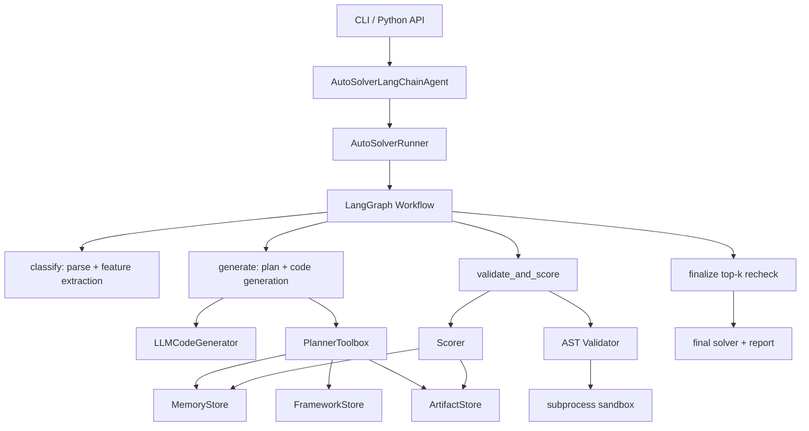

# AutoSolver Agent 详解报告
 
> 覆盖范围：源码包 `autosolver_agent/`、求解器目录 `solvers/`、示例文件 `examples/`、测试目录 `tests/`、工程配置文件。  
> 不覆盖范围：`__pycache__/`、`.venv/`、`runs/`、`dist/` 等运行或构建产物。

## 1. 项目总览

AutoSolver Agent 是一个“自动生成配送分配问题 solver 的 Agent 系统”。它的核心思想是：

1. 读取配送分配 case。
2. 提取客观特征。
3. 让 LLM 基于历史记忆和工具上下文规划求解策略。
4. 让 LLM 生成符合 `solve(input_text: str) -> list` 契约的 Python 代码。
5. 用确定性程序对代码做安全检查、运行检查和评分。
6. 将成功与失败结果沉淀到长期记忆与框架记忆中。
7. 从候选中最终复核并输出最佳 solver。

这不是一个简单的“调用大模型写代码”的项目，而是一个把 LLM 放入工程约束、验证闭环和可审计流程中的自动求解平台。



## 2. 顶层目录与文件

| 路径 | 类型 | 作用 |
| --- | --- | --- |
| `README.md` | 文档 | 项目主说明，覆盖背景、输入输出契约、架构、运行方式、部署方式。 |
| `RELEASE.md` | 文档 | 发布说明，记录版本演进和验证清单。 |
| `pyproject.toml` | Python 包配置 | 声明包名、版本、依赖、CLI 入口、Ruff、Mypy、Coverage 配置。 |
| `requirements.txt` | 依赖列表 | 简化安装依赖，和 `pyproject.toml` 中依赖基本一致。 |
| `Dockerfile` | 容器配置 | 构建可运行镜像，默认入口为 `autosolver-agent`。 |
| `run.sh` | 运行脚本 | 封装本地运行时环境变量、默认 case、baseline solver 和 CLI 参数。 |
| `.github/workflows/ci.yml` | CI | 自动运行 Ruff、Mypy、单元测试和 Docker smoke test。 |
| `.github/workflows/publish-image.yml` | 发布流水线 | 将 Docker 镜像发布到 GHCR。 |
| `autosolver_agent/` | 主源码包 | Agent 编排、LLM 生成、验证、评分、记忆、工作流。 |
| `solvers/` | 求解器目录 | 种子 solver、当前 solver、最佳 solver。 |
| `examples/` | 示例 | 示例 case、示例解、模板 solver。 |
| `tests/` | 测试 | 单元测试和集成式行为测试。 |

## 3. 运行主链路

```text
CLI / Python API
  -> AutoSolverLangChainAgent
  -> AutoSolverRunner
  -> AutoSolverWorkflow
  -> classify
  -> generate
  -> validate_and_score
  -> finalize
  -> final solver + report
```

关键设计选择：

- 用 `AutoSolverLangChainAgent` 封装对外 API，让命令行和 Python 调用共享一套入口。
- 用 `AutoSolverRunner` 区分单进程和多 worker 模式。
- 用 `LangGraph` 表达有状态、多阶段、可循环的 Agent 工作流。
- 用 Pydantic 约束 LLM 结构化输出，避免大模型自由发挥导致系统无法解析。
- 用 Validator、Runtime Sandbox、Scorer 确定性裁决 LLM 生成的代码。
- 用 MemoryStore 和 FrameworkStore 保存跨轮次经验。

---

# 4. `autosolver_agent/` 主源码包

## 4.1 `autosolver_agent/__init__.py`

### 文件作用

包初始化文件，对外暴露主类和版本号。

### 内容说明

| 名称 | 类型 | 作用 |
| --- | --- | --- |
| `AutoSolverLangChainAgent` | 导出类 | 让用户可以 `from autosolver_agent import AutoSolverLangChainAgent`。 |
| `__version__ = "1.5.5"` | 常量 | 包版本号，CLI 和发布流程会使用。 |
| `__all__` | 导出控制 | 明确包级 API。 |

### 为什么这样设计

可以理解为：`__init__.py` ，外部调用不必知道内部目录结构。

---

## 4.2 `autosolver_agent/models.py`

### 文件作用

定义项目中跨模块传递的数据结构。这里大多使用 `dataclass`，因为这些结构主要是简单的数据容器。

### 类说明

| 类名 | 作用 | 使用位置 |
| --- | --- | --- |
| `Case` | 表示一个原始 case 文件，包含名称、文本、路径。 | `agent.py` 加载 case 后传入 workflow、validator、scorer。 |
| `ParseDiagnostic` | 表示解析错误诊断，包括错误码、消息、行号、原始行。 | `caseio.py` 在解析失败时构造。 |
| `ParsedCase` | 表示解析后的 case，包括行、任务组、骑手、任务列表等索引结构。 | `caseio.py`、`validator.py`、`scorer.py`。 |
| `StrategySpec` | 策略说明数据结构，保留给策略知识描述。 | 当前主流程更多使用 `framework.py` 中的 Pydantic 模型。 |
| `SolverSkill` | solver 实现技巧描述。 | 作为知识结构概念，与 framework 中 skill 对应。 |
| `SolverExample` | 示例 solver 的元信息。 | 用于描述可复用样例的概念结构。 |
| `Candidate` | 一个候选 solver，包含名称、代码、理由、迭代轮次、来源。 | 贯穿生成、验证、评分、artifact 保存。 |
| `ValidationResult` | 验证结果，包含是否有效、阶段、错误、运行时、最后答案。 | Validator 返回，workflow 记录。 |
| `ScoreResult` | 评分结果，包含 rank、覆盖、penalty、运行时、失败数、逐 case 结果。 | Scorer 返回，workflow 用于比较候选。 |
| `IterationArtifact` | 某个候选落盘后的文件路径集合。 | ArtifactStore 返回，report 中展示。 |

### 设计理由

- `dataclass` 写法轻量，适合“只装数据、不做复杂校验”的对象。
- 这些类型让模块之间传递数据时更清晰，也便于测试断言。

---

## 4.3 `autosolver_agent/agent.py`

### 文件作用

项目对外的 Python API 主入口。它负责把用户配置转成内部运行配置，并启动 Runner。

### 类：`AutoSolverLangChainAgent`

#### `__init__(...)`

保存用户传入的所有运行参数，例如：

- 输入 case 路径。
- 输出 solver 路径。
- 总预算和每 case 超时。
- LLM 模型和 base URL。
- memory、artifact 目录。
- 最大迭代轮数。
- repair 次数。
- worker 数。
- baseline solver。

为什么这样做：  
构造函数只保存配置，不立刻执行重逻辑，这样对象创建和真正运行分离，便于测试和复用。

#### `run()`

完整运行入口：

1. 调用 `_validate_config()` 检查参数。
2. 如果没有显式传 case，则从当前目录发现 case。
3. 用 `load_cases()` 读取 case。
4. 用 `parse_case()` 解析 case。
5. 根据预算计算 deadline。
6. 构造 `AutoSolverRunConfig`。
7. 创建 `AutoSolverRunner` 并运行。
8. 将 report 写入 `output_path + ".report.json"`。
9. 返回 report。

为什么这样设计：  
把“对外使用体验”集中在一个方法里，用户只需要调用 `agent.run()`。

#### `run_json()`

调用 `run()` 后把结果序列化为 JSON 字符串。

适用场景：  
命令行输出、日志保存、调试。

#### `_validate_config()`

检查数值参数是否合法，比如：

- `budget_seconds > 0`
- `iterations >= 1`
- `strategy_workers >= 1`

为什么重要：  
在真正加载 case 或调用 LLM 前尽早失败，错误更清晰，也避免浪费资源。

---

## 4.4 `autosolver_agent/cli.py`

### 文件作用

命令行入口。用户执行 `autosolver-agent` 时会进入这里。

### 函数说明

#### `_positive_float(value)`

把字符串转成正浮点数，要求大于 0。用于 `--budget`、`--per-case-timeout` 等参数。

#### `_positive_int(value)`

把字符串转成正整数，要求至少为 1。用于 `--iterations`、`--max-cases` 等参数。

#### `_non_negative_int(value)`

把字符串转成非负整数。用于 `--max-repair-attempts`。

#### `_non_negative_float(value)`

把字符串转成非负浮点数。用于 `--bandit-exploration`。

#### `build_parser()`

创建 `argparse.ArgumentParser`，定义所有 CLI 参数。

核心参数：

- `--cases`
- `--out`
- `--budget`
- `--iterations`
- `--memory-dir`
- `--artifact-dir`
- `--llm-model`
- `--llm-base-url`
- `--baseline-solver`
- `--strategy-workers`
- `--summary-out`
- `--event-log`

为什么用 `argparse`：  
它是 Python 标准库，无需额外依赖，适合命令行工具。

#### `main()`

解析参数，创建 `AutoSolverLangChainAgent`，调用 `run()`，最后打印 JSON report。

---

## 4.5 `autosolver_agent/caseio.py`

### 文件作用

负责 case 文件的读取、解析、特征提取和评分规则。它是项目的“确定性规则层”。

### 类：`CaseParseError`

#### `__init__(diagnostics)`

保存解析错误列表，并把前几个错误拼成异常消息。

为什么这样设计：  
相比只抛一个字符串，诊断对象能携带错误码、行号、原始行，便于用户定位数据问题。

### 函数说明

#### `parse_case(text, case_name=None, path=None)`

对外解析入口。内部调用 `_parse_case_with_diagnostics()`，如果有诊断错误就抛 `CaseParseError`，否则返回 `ParsedCase`。

#### `_parse_case_with_diagnostics(text, case_name=None, path=None)`

真正解析 TSV 文本：

1. 按行读取。
2. 跳过空行。
3. 如果第一行是精确表头，则跳过。
4. 检查字段数是否足够。
5. 解析任务组、骑手、score、willingness。
6. 构建：
   - `rows`
   - `by_key`
   - `key_tasks`
   - `all_tasks`
   - `all_couriers`

为什么返回诊断而不是立刻抛错：  
可以一次收集多个输入问题，而不是遇到第一个错误就停止。

#### `_is_header_row(parts)`

判断前四列是否正好是：

```text
task_id_list courier_id total_score willingness
```

为什么要求精确表头：  
避免把真实任务名 `task_id_list` 误判成表头。

#### `load_cases(paths, max_cases)`

从文件路径读取 case：

1. 限制最多读取 `max_cases` 个。
2. 检查文件能否读取。
3. 检查第一行是否包含表头。
4. 预解析确保格式正确。
5. 返回 `Case` 列表。

#### `discover_case_paths(root)`

从目录中发现 `.txt` case 文件，排除 `describe.txt` 和 `example_solution.txt`。

用途：  
当用户没有显式传 `--cases` 时自动发现输入。

#### `dataset_features(parsed)`

从单个 `ParsedCase` 提取客观特征：

- 行数。
- 任务数。
- 骑手数。
- 任务组数。
- 合单比例。
- 单任务组比例。
- 平均 group size。
- willingness 分布。
- score 分布。
- 每组候选数。
- 每骑手可选组数。
- capacity ratio。

为什么重要：  
这些特征会给 LLM 和 bandit 使用，帮助选择适合的策略。

#### `aggregate_features(features)`

把多个 case 的特征合并为一个 aggregate：

- 布尔值取 `any`。
- 数值取平均。
- 其他值保留列表。

用途：  
一次运行可能有多个 case，LLM 需要一个整体画像。

#### `penalty_for_group(parsed, task_key, couriers)`

计算某个任务组由一组骑手承接时的 penalty：

- 骑手都拒绝时使用 fallback。
- 至少有人接受时按 willingness 加权 score。

这是评分规则的核心公式之一。

#### `score_answer(parsed, answer)`

验证并评分 solver 返回结果：

1. 检查返回值必须是 list。
2. 每项必须是 `(task_id_list, courier_ids)`。
3. `courier_ids` 必须是非空 `list[str]`。
4. 任务不能重复。
5. 骑手不能重复。
6. 骑手必须对该任务组有效。
7. 累计 penalty。
8. 未覆盖任务按 fallback 计 penalty。

为什么重要：  
这是最终裁判规则。LLM 生成的 solver 好不好，必须由它说了算。

#### `_diagnostic(...)`

创建 `ParseDiagnostic` 对象，减少重复字段组装。

---

## 4.6 `autosolver_agent/json_utils.py`

### 文件作用

处理 LLM 返回 JSON 不稳定的问题。

### 类：`JSONExtractionError`

表示无法从文本中恢复 JSON。

### 函数说明

#### `load_json_document(text_or_value)`

加载 JSON：

1. 如果输入已经是 dict/list，直接返回。
2. 尝试 `json.loads()`。
3. 如果失败，从 Markdown code block 中提取 JSON。
4. 再从普通文本中寻找第一个平衡的 `{...}` 或 `[...]`。
5. 仍失败则抛 `JSONExtractionError`。

为什么需要：  
LLM 常常会返回：

````text
下面是 JSON：
```json
{...}
```
````

或者夹杂 `<think>...</think>`，这个工具能容错恢复。

#### `_json_candidates(text)`

生成可能的 JSON 文本片段：

- Markdown fenced code block。
- 去除 `<think>` 后的平衡 JSON 片段。

#### `_balanced_json_at(text, start)`

从某个 `{` 或 `[` 开始，扫描字符串，找到完整闭合的 JSON 片段。它会正确处理字符串和转义字符。

---

## 4.7 `autosolver_agent/artifacts.py`

### 文件作用

负责把候选代码、理由、验证结果、评分结果和影响分析写入磁盘。

### 类：`ArtifactStore`

#### `__init__(artifact_dir)`

保存 artifact 根目录并创建目录。

#### `iteration_dir(iteration)`

返回某一轮迭代对应的目录，例如：

```text
runs/autosolver_artifacts/iteration_001
```

如果目录不存在则创建。

#### `save_candidate(candidate)`

保存候选 solver：

- `{candidate.name}.py`
- `{candidate.name}.rationale.json`
- 预先生成 validation 路径。

返回 `IterationArtifact`。

#### `save_validation(artifact, validation)`

保存验证结果 JSON。

#### `save_score(artifact, score)`

保存评分结果 JSON，并更新 artifact 的 `score_path`。

#### `save_impact(artifact, impact)`

保存影响分析 JSON，并更新 artifact 的 `impact_path`。

#### `disk_results(limit=20)`

扫描 artifact 目录中的 `.score.json`，按 rank 排序，返回历史较优结果。

用途：  
给后续 LLM 生成候选时参考磁盘上的历史成绩。

#### `summary()`

返回本次运行中 artifact 的可序列化摘要。

### 函数说明

#### `serialize(value)`

把 dataclass、tuple、list、dict 转换成 JSON 友好的结构。

#### `write_json(path, value)`

原子写 JSON：

1. 先写到 `.tmp` 文件。
2. 再用 `os.replace()` 替换目标文件。

为什么这样设计：  
防止写文件过程中程序崩溃导致 JSON 半截损坏。

---

## 4.8 `autosolver_agent/events.py`

### 文件作用

写结构化事件日志和记录阶段耗时。

### 类：`EventRecorder`

#### `__init__(path, run_id=None, truncate=True)`

初始化事件日志路径和 run id。如果 `truncate=True`，会清空旧日志。

#### `record(...)`

追加一行 JSONL 事件。字段包括：

- run_id
- created_at
- phase
- iteration
- event
- candidate
- candidate_hash
- elapsed
- context

为什么用 JSONL：  
一行一个 JSON，适合长期追加，也适合后续用脚本分析。

### 类：`PhaseTimer`

#### `__init__()`

初始化阶段耗时字典。

#### `mark(phase, elapsed)`

给某个阶段累计耗时。

### 函数说明

#### `code_hash(code)`

计算候选代码 SHA256 的前 16 位，用于候选指纹。

#### `now_monotonic()`

返回当前时间。这里封装一层便于统一调用和测试。

---

## 4.9 `autosolver_agent/runtime.py`

### 文件作用

在受限子进程中运行候选 solver。它是安全边界的一部分。

### 常量说明

| 常量 | 作用 |
| --- | --- |
| `SAFE_IMPORT_ROOTS` | 候选代码允许 import 的模块白名单。 |
| `SAFE_BUILTIN_NAMES` | 候选代码可用内置函数/异常白名单。 |

### 类：`ExecutionPolicy`

执行策略配置：

- `allowed_import_roots`
- `max_memory_mb`
- `cpu_grace_seconds`
- `kill_grace_seconds`

使用 `frozen=True`，表示创建后不应被修改。

### 函数说明

#### `_candidate_worker(code, case_text, queue, policy)`

子进程入口：

1. 应用资源限制。
2. 构造受限 namespace。
3. 执行候选代码。
4. 找到 `solve` 函数。
5. 调用 `solve(case_text)`。
6. 把状态、答案、耗时、错误通过 queue 返回父进程。

#### `run_candidate(code, case_text, timeout, policy=None)`

父进程调用入口：

1. 创建 `multiprocessing.Queue`。
2. 启动子进程。
3. 等待 `timeout`。
4. 超时则 terminate/kill。
5. 读取子进程返回。
6. 返回统一 dict。

为什么用子进程：  
候选代码可能死循环或污染环境。子进程隔离更安全。

#### `_safe_builtins(policy)`

根据白名单构造可用内置函数，并替换 `__import__` 为受控 import。

#### `_safe_import(policy)`

返回内部函数 `guarded_import`。它只允许导入白名单中的根模块，拒绝相对 import。

#### `_apply_resource_limits(policy)`

在 POSIX 系统中设置：

- CPU 时间限制。
- 地址空间内存限制。

#### `raise_timeout()`

收到 CPU 超限信号时抛 `TimeoutError`。

---

## 4.10 `autosolver_agent/tools/validator.py`

### 文件作用

验证 LLM 生成的候选代码是否安全、是否符合契约、是否能在样例 case 上返回合法结果。

### 常量说明

| 常量 | 作用 |
| --- | --- |
| `FORBIDDEN_IMPORT_ROOTS` | 明确禁止的危险 import，如 `os`、`subprocess`、`socket`。 |
| `FORBIDDEN_CALLS` | 明确禁止的函数调用，如 `open`、`eval`、`exec`。 |
| `FORBIDDEN_NAMES` | 禁止读取的危险名字，如 `__builtins__`。 |
| `ALLOWED_IMPORT_ROOTS` | 来自 runtime 的 import 白名单。 |

### 类：`Validator`

#### `__init__(smoke_timeout)`

设置验证阶段候选运行的超时时间。

#### `validate_static(code)`

静态检查：

1. 检查是否包含 `def solve`。
2. 用 `ast.parse()` 解析代码。
3. 检查顶层 `solve` 函数是否存在。
4. 遍历 AST：
   - import 是否白名单。
   - 是否调用危险函数。
   - 是否读取危险名字。
   - 是否访问双下划线属性。
5. 尝试 `compile()`。
6. 返回 `ValidationResult`。

为什么用 AST：  
比字符串搜索可靠，可以理解代码结构。

#### `validate_runtime(code, cases, parsed_cases, max_cases=None)`

运行时验证：

1. 对 case 调用 `run_candidate()`。
2. 如果运行错误或超时，记录 runtime error。
3. 如果运行成功，用 `score_answer()` 检查输出是否合法。
4. 汇总错误和运行时。

#### `validate(code, cases, parsed_cases, max_cases=None)`

先静态验证，再运行时验证。任何阶段失败都直接返回失败结果。

#### `_call_name(node)`

从 AST 调用节点中提取调用名，例如：

- `eval(...)` -> `eval`
- `foo.bar(...)` -> `foo.bar`

---

## 4.11 `autosolver_agent/tools/scorer.py`

### 文件作用

按正式规则运行候选 solver 并计算排名。

### 类：`Scorer`

#### `__init__(per_case_timeout)`

保存每个 case 的运行超时。

#### `score(candidate, cases, parsed_cases, best=None, timeout=None)`

评分主函数：

1. 对每个 case 调用 `run_candidate()`。
2. 运行失败则加大额失败 penalty。
3. 运行成功则用 `score_answer()` 评分。
4. 统计：
   - `failures`
   - `total_covered`
   - `total_tasks`
   - `total_penalty`
   - `total_runtime`
5. 构造 rank：

```text
(failures, -total_covered, total_penalty, total_runtime)
```

6. 计算 convergence。
7. 返回 `ScoreResult`。

#### `_convergence(rank, best)`

比较当前候选和历史最佳：

- 是否改进。
- penalty 差值。
- 覆盖任务差值。
- 之前最佳是谁。

---

## 4.12 `autosolver_agent/tools/langchain_tools.py`

### 文件作用

给 LLM planner 暴露只读工具，让 LLM 可以查询当前实例、框架、记忆和最佳候选。

### 类：`PlannerToolbox`

#### `__init__(...)`

保存工具需要的上下文：

- instance features
- solver framework
- memory store
- artifacts
- feature query
- memory top-k
- bandit exploration
- best summary
- candidate arms

#### `get_instance_features()`

返回当前实例特征 JSON。

#### `get_solver_framework()`

返回当前 LLM 维护的求解框架。

#### `retrieve_similar_experiments(top_k=None)`

调用 MemoryStore 检索相似历史实验。

#### `get_bandit_recommendations(limit=5)`

调用 MemoryStore 返回 UCB bandit 策略推荐。

#### `get_best_artifact_summary()`

返回当前最佳候选摘要。

#### `snapshot()`

一次性返回工具上下文快照，用于记录和后续 code generation prompt。

#### `_record(name, args, result)`

记录工具调用 trace，并把结果序列化成 JSON 字符串返回给 LLM。

### 函数：`build_langchain_tools(toolbox)`

把 `PlannerToolbox` 方法包装成 LangChain `StructuredTool`。

内部函数 `make_tool(...)` 用于减少重复包装代码。

---

## 4.13 `autosolver_agent/llm/schema.py`

### 文件作用

定义 LLM 结构化输出的 Pydantic schema。

### 类说明

#### `SolverPlan`

表示生成代码前的计划，包含：

- `name`
- `strategy_combination`
- `parameter_changes`
- `exploration_mode`
- `reasoning`
- `risk_control`
- `generation_directives`

方法 `_strategy_not_empty()` 确保策略组合不能为空。

#### `CandidateRationale`

表示候选代码的理由元数据：

- 名称。
- 思路。
- 策略组合。
- 参数变化。
- 预期效果。
- 风险控制。

方法：

- `_sanitize_name()`：清洗候选名称，只保留安全字符。
- `_strategy_not_empty()`：确保策略组合非空。

#### `CandidateEnvelope`

LLM 生成候选时必须返回的外层结构：

- `rationale`
- `code`

方法 `_code_has_contract()` 确保代码里包含 `def solve`。

#### `StructuredOutputError`

当 LLM 输出无法解析成 schema 时抛出。它保存 `raw_response`，方便 repair prompt 使用。

### 函数说明

#### `parse_solver_plan(text_or_value)`

解析 `SolverPlan`。输入可为 JSON 字符串、dict 或带 Markdown 包裹的文本。

#### `parse_candidate_envelope(text_or_value)`

解析 `CandidateEnvelope`，并把 Pydantic 校验错误包装成 `StructuredOutputError`。

#### `candidate_schema_text()`

返回 `CandidateEnvelope` 的 JSON schema 字符串，用于 prompt。

#### `plan_schema_text()`

返回 `SolverPlan` 的 JSON schema 字符串，用于 prompt。

#### `model_dump(value)`

把 Pydantic 模型转为 JSON mode dict。

#### `_load_json_like(text_or_value)`

调用 `load_json_document()`，如果失败则转成 `StructuredOutputError`。

---

## 4.14 `autosolver_agent/llm/generator.py`

### 文件作用

封装所有 LLM 调用：规划、框架维护、实例解释、代码生成、修复。

### 关键常量

| 常量 | 作用 |
| --- | --- |
| `SOLVER_OUTPUT_CONTRACT` | 固定 solver 输出契约，反复写入 prompt。 |
| `ALLOWED_IMPORT_ROOTS_TEXT` | 候选代码允许 import 的模块列表，写入 prompt。 |

### 类：`LLMCodeGenerator`

#### `__init__(model=None, base_url=None, temperature=0.2, llm=None)`

初始化 LLM 配置：

- 模型名。
- OpenAI 兼容 base URL。
- temperature。
- wire API。
- reasoning effort。
- extra body。
- 请求超时。
- 是否禁用响应存储。

如果传入 `llm`，则用于测试或自定义模型；否则通过 `_build_langchain_llm()` 创建 ChatOpenAI。

#### `validate_environment()`

检查：

- 是否有 `OPENAI_API_KEY` 或 `OPENAI_KEY`。
- 是否安装 `langchain-openai`。

为什么重要：  
真实 LLM 调用前先失败，错误更清楚。

#### `_build_langchain_llm()`

构造 `ChatOpenAI` 对象，把环境变量配置转为 LangChain 参数。

#### `plan(...)`

让 LLM 生成 `SolverPlan`：

1. 要求 LLM 使用工具。
2. 构造 system/user prompt。
3. 允许最多 4 轮工具调用。
4. 执行工具并把工具结果回填给 LLM。
5. 解析最终 JSON 为 `SolverPlan`。
6. 记录 planner trace 和 tool calls。

为什么这样设计：  
规划阶段先查资料再写计划，比直接生成代码更可控。

#### `bootstrap_framework(objective_features, memory_digest, case_samples)`

当 framework memory 为空时，让 LLM 生成初始求解框架：

- feature dimensions
- strategies
- skills

#### `interpret_instances(...)`

让 LLM 解释当前 case 特征，输出：

- tags
- opportunities
- risks
- recommended_focus
- reasoning
- confidence

#### `reflect_framework(...)`

每轮候选评估后，让 LLM 基于成功/失败证据更新 framework。

重要约束：  
它只能更新策略知识，不能修改 validator、scorer、runtime、parser 或输出契约。

#### `generate_from_plan(...)`

根据 `SolverPlan` 生成完整候选 solver：

1. 构造严格 system prompt。
2. 提供实例特征、框架、记忆、历史结果、case 样例、超时。
3. 要求返回 `CandidateEnvelope` JSON。
4. 解析为 `Candidate`。

#### `repair(...)`

当 schema 失败或 validation 失败时，要求 LLM 修复：

- 传入错误列表。
- 传入失败代码。
- 传入失败 rationale。
- 传入 best summary。
- 传入 score delta。

返回新的 `Candidate`。

#### `_invoke(system, user)`

调用 LLM 并返回文本内容。

#### `_content(response)`

兼容不同 LLM 返回格式：

- 字符串。
- LangChain message。
- OpenAI content list。

### 文件级函数

#### `sanitize_name(value, default_name)`

清洗候选名，确保适合作为文件名和标识符。

#### `_json(value)`

把对象格式化成 JSON 字符串，用于 prompt。

#### `_tool_message(content, tool_call_id, name)`

构造 LangChain `ToolMessage`，把工具结果交回 LLM。

#### `_env_bool(name)`

解析布尔环境变量。

#### `_env_float(*names, default=None)`

按多个候选变量名读取浮点环境变量。

#### `_env_json(*names)`

读取并解析 JSON 环境变量，例如 provider-specific extra body。

---

## 4.15 `autosolver_agent/framework.py`

### 文件作用

管理 LLM 维护的“求解知识框架”。它与实验记忆不同，保存的是更抽象的策略知识。

### Pydantic 模型

#### `FrameworkValidationError`

框架解析、校验或持久化失败时抛出。

#### `FeatureDimension`

表示一个“如何理解实例特征”的维度。

字段包括：

- name
- description
- signals
- interpretation_notes
- status
- confidence

方法 `_clean_name()` 清洗名称。

#### `StrategyKnowledge`

表示一个求解策略知识。

字段包括：

- name
- description
- applicable_tags
- feature_signals
- implementation_notes
- recommended_parameters
- risks
- status
- confidence

方法 `_clean_name()` 清洗名称。

#### `SkillKnowledge`

表示实现技巧。

字段包括：

- name
- strategy_names
- construction_notes
- code_contract
- constraints
- examples
- status
- confidence

方法：

- `_clean_name()`：清洗 skill 名。
- `_clean_strategy_names()`：清洗引用的 strategy 名。

#### `SolverFramework`

完整框架文档：

- schema_version
- feature_dimensions
- strategies
- skills
- source
- updated_at

方法 `_validate_framework()` 检查：

- schema version 是否匹配。
- feature、strategy、skill 名称是否唯一。
- skill 引用的 strategy 是否存在且未 retired。

#### `FrameworkUpdate`

LLM 每轮反思后返回的增量更新：

- 新增或替换 feature/strategy/skill。
- retired 名称列表。
- update reason。
- confidence。

方法 `_clean_retire_names()` 清洗 retired 名。

#### `InstanceInterpretation`

LLM 对当前实例的解释：

- tags
- opportunities
- risks
- recommended_focus
- feature_notes
- reasoning
- confidence

方法 `_clean_names()` 清洗 tags 和 focus 名称。

### 类：`FrameworkStore`

#### `__init__(memory_dir)`

设置 framework 文件路径：

```text
{memory_dir}/framework_memory.json
```

并加载已有文档或创建空文档。

#### `framework`

属性方法，把当前 JSON 文档转为 `SolverFramework`。

#### `is_empty()`

判断 framework 是否没有 feature、strategy、skill。

#### `reload()`

重新从磁盘加载 framework。

#### `bootstrap(framework, source)`

初始化 framework：

1. 校验 payload 安全。
2. 加文件锁。
3. 如果已有 framework，则跳过。
4. 写入新 framework。
5. 写 history。

#### `apply_update(update, source, iteration)`

应用 LLM 增量更新：

1. 校验安全。
2. 加锁。
3. 合并更新。
4. 写 history。
5. 原子写文件。

#### `sanitize_update(update)`

修复 LLM update 中 skill 引用未知 strategy 的问题：

- 删除无合法 strategy 的 skill。
- 保留部分合法引用。
- 返回 sanitized update 和详情。

#### `snapshot()`

返回完整快照，用于 report。

#### `prompt_context()`

返回适合放进 prompt 的 framework JSON 和维护规则。

#### `digest()`

返回精简摘要：

- counts
- strategy names
- feature names
- skill names
- recent updates

#### `candidate_strategy_names(limit=20)`

返回 active strategy 名称，供并行策略生成使用。

#### `counts()`

返回 feature、strategy、skill 数量。

#### `_load_document()`

加锁读取 framework 文件。

#### `_read_document_unlocked()`

不加锁读取 JSON 文件。由上层保证锁。

#### `_new_document()`

创建空 framework 文档。

#### `_ensure_document(value)`

检查文档 schema、安全 payload、history 类型，并补齐字段。

#### `_merge_update(framework, update)`

将增量 update 合并到现有 framework：

- retired 名称从当前集合移除。
- update 中新条目覆盖旧条目。

### 文件级函数

#### `parse_solver_framework(text_or_value)`

从 LLM 输出解析 `SolverFramework`，并清洗 framework payload。

#### `parse_instance_interpretation(text_or_value)`

解析实例解释。

#### `parse_framework_update(text_or_value)`

解析 framework 增量更新。

#### `solver_framework_schema_text()`

返回 `SolverFramework` JSON schema。

#### `instance_interpretation_schema_text()`

返回 `InstanceInterpretation` JSON schema。

#### `framework_update_schema_text()`

返回 `FrameworkUpdate` JSON schema。

#### `_load_json_like(text_or_value)`

调用 JSON 恢复工具并包装异常。

#### `_clean_name(value, default)`

清洗名称，只保留安全字符并限制长度。

#### `_ensure_unique(kind, names)`

检查名称唯一性。

#### `_validate_safe_payload(value)`

递归检查 payload 中是否含危险片段，例如 `import os`、`open(`、`eval(`。

#### `_sanitize_llm_payload(value)`

递归清洗 LLM 返回文本中的危险片段，将其替换为安全标记。

#### `_sanitize_framework_payload(value)`

专门清洗 framework，并删除 skill 中未知 strategy 引用。

#### `_framework_counts(framework)`

统计 active/total feature、strategy、skill。

#### `_trim_history(history)`

限制 history 长度。

#### `_now()`

返回 UTC ISO 时间。

### 类：`_FileLock`

跨平台文件锁，用于防止多 worker 同时写 framework。

方法：

- `__init__(path)`：保存锁文件路径。
- `__enter__()`：打开锁文件并加锁。
- `__exit__()`：释放锁并关闭文件。
- `_lock()`：Windows 用 `msvcrt`，其他系统用 `fcntl`。
- `_unlock()`：释放对应平台锁。

#### `_write_json_atomic(path, value)`

原子写 JSON。

---

## 4.16 `autosolver_agent/memory/store.py`

### 文件作用

管理短期记忆、长期实验记忆、相似实验检索和 UCB bandit 策略推荐。

### 类：`MemoryStore`

#### `__init__(memory_dir, max_long_term_items=None)`

初始化：

- memory 目录。
- long term JSON 路径。
- 文件锁路径。
- retention 上限。
- short-term 内存结构。
- 加载或创建 long-term memory。

#### `_load_long_term()`

加锁读取 long-term memory。

#### `_read_long_term_unlocked()`

读取 JSON，不处理锁。

#### `_new_long_term()`

创建新的 long-term memory 文档：

- schema version。
- strategy_history。
- feature_strategy_effects。
- experiments。
- bandit_arms。
- metadata.retention。

#### `_ensure_schema(value)`

检查 memory schema：

- version 必须匹配。
- required 字段必须存在。
- list 字段必须真的是 list。
- bandit_arms 必须是 dict。
- metadata.retention 必须存在。
- 超长列表会 trim。

#### `digest(limit=8, features=None, top_k=5, exploration=1.4)`

返回给 LLM 使用的记忆摘要：

- 最近策略历史。
- 最近 feature-strategy 效果。
- 最近短期迭代。
- 最近错误。
- 相似实验。
- bandit 推荐。
- 最佳实验。

#### `record_candidate(iteration, candidate_name, rationale, selected_features)`

把候选生成事件写入 short-term memory。

#### `record_validation(iteration, validation)`

记录验证结果。失败时也写入 short-term errors。

#### `record_score(iteration, score, impact)`

记录评分结果：

- short-term scores。
- short-term impact。
- long-term strategy_history。
- long-term feature_strategy_effects。

#### `record_experiment(...)`

记录一次完整实验：

- candidate。
- features。
- strategy。
- params。
- score。
- validation。
- artifact paths。
- failure reason。
- reward。

同时更新 bandit arm。

#### `retrieve_similar(features, top_k=5)`

用压缩后的数值特征计算距离，并叠加 tag 相似度，返回最相似历史实验。

#### `bandit_recommendations(candidate_arms=None, exploration=1.4, limit=5)`

用 UCB 算法推荐策略：

- 试过少的策略得到探索加成。
- 表现好的策略得到利用优势。
- count 为 0 的策略标记为 `explore_cold_start`。

#### `best_experiment_summary()`

从 long-term experiments 中找失败数为 0 且 rank 最优的实验。

#### `save(short_term_path=None)`

加锁合并最新 long-term 记录并写盘，也可写 short-term 文件。

#### `_merge_long_term(latest)`

把当前对象新增的记录合并到磁盘上最新版本，避免并发覆盖。

#### `_trim_long_term(value)`

限制 long-term list 长度。

#### `_list_counts(value)`

统计 long-term 各 list 当前长度，用于之后计算增量。

#### `_update_bandit(record)`

根据实验记录更新 bandit arms。

### 类：`_FileLock`

与 framework 中类似，用于 memory 文件并发写保护。

方法：

- `__init__`
- `__enter__`
- `__exit__`
- `_lock`
- `_unlock`

### 文件级函数

#### `_now()`

返回 UTC ISO 时间。

#### `_positive_int(value, env_name, default)`

读取正整数配置，支持环境变量覆盖。

#### `_schema_version(value)`

解析 memory schema version。

#### `_as_list(value, field_name="value")`

确保字段是 `list[dict]`。

#### `_build_bandit_arms(records)`

从历史实验重建 bandit arm 统计。

#### `_apply_bandit_record(arms, record)`

根据单条实验更新 arm 的 count、total_reward、mean_reward、failures。

#### `_write_json_atomic(path, value)`

原子写 JSON。

#### `_compact_features(features)`

只保留用于相似度计算的关键数值特征。

#### `_feature_distance(left, right)`

计算归一化 L1 距离。

#### `_score_summary(score)`

把 `ScoreResult` 精简成 JSON 友好摘要。

#### `_validation_summary(validation)`

把 `ValidationResult` 精简成摘要。

#### `_reward(score, validation, failure_reason)`

把实验表现转成 bandit reward：

- 失败或验证不通过强负奖励。
- 覆盖率越高越好。
- 平均 penalty 越低越好。
- runtime 略微惩罚。

#### `_arm_key(strategy)`

把 strategy 列表规范化成 bandit arm 名称。

---

## 4.17 `autosolver_agent/workflow/services.py`

### 文件作用

定义 workflow 配置、运行态和轻量服务门面。

### 数据类

#### `WorkflowConfig`

保存 workflow 配置：

- iterations
- deadline
- timeouts
- strategy_workers
- output_path
- finalize_top_k
- repair attempts
- memory settings
- summary output

#### `WorkflowRunState`

保存单次 run 的动态状态：

- run_id
- event_log_path
- timings
- candidate_hashes

### 服务类

这些类很薄，主要是把 workflow 内部方法包成服务入口，便于分层表达。

#### `GenerationService`

- `__init__(workflow)`：保存 workflow。
- `generate(state)`：调用 `workflow._generate_candidate(state)`。

#### `EvaluationService`

- `__init__(workflow)`：保存 workflow。
- `validate_and_score(state)`：调用 `workflow._validate_and_score_candidate(state)`。

#### `RepairService`

- `repair_schema_failure(...)`：调用 workflow schema repair。
- `repair_validation_failure(...)`：调用 workflow validation repair。

#### `FinalizationService`

- `finalize(state)`：调用 workflow finalize。

#### `ReportBuilder`

- `build()`：调用 workflow report payload。

### 函数：`build_event_recorder(path, run_id)`

创建 `EventRecorder`，默认 truncate 旧事件日志。

---

## 4.18 `autosolver_agent/workflow/graph.py`

### 文件作用

项目最核心的工作流编排文件。它定义 LangGraph 节点、状态流转、候选生成、验证评分、修复、记忆、framework 更新、最终输出和 report。

### 类型

#### `WorkflowState`

LangGraph 状态字典，可能包含：

- phase
- iteration
- candidate/candidates
- plan/plans
- stop_reason

#### `CandidateEvaluationItem`

验证评分过程中的中间项：

- candidate
- validation
- score
- impact

### 类：`AutoSolverWorkflow`

#### `__init__(...)`

初始化 workflow 全部依赖和状态：

- cases、parsed_cases。
- timeouts、deadline。
- memory、artifacts、llm。
- framework store。
- validator、scorer。
- 各种 trace、history、report 容器。
- service 门面。

这是 workflow 的“组装器”。

#### `run()`

构建 LangGraph 并从 `classify` 开始执行，最后返回 report。

#### `run_worker_loop(...)`

多进程 worker 模式使用：

1. 先做 classify。
2. 根据全局 iteration counter 领取迭代号。
3. 循环 generate、validate_and_score。
4. 如果 worker 中途 LLM 出错但已有 score，则保留部分结果返回。

#### `_build_graph()`

构建 LangGraph：

```text
classify -> generate -> validate_and_score
validate_and_score -> generate 或 finalize
finalize -> END
```

#### `_prepare_worker_loop(start_iteration)`

worker 模式下先执行 classify，然后返回 generate 状态。

#### `_node_classify(state)`

节点包装器，调用 `_classify_instances()` 并计时。

#### `_node_generate(state)`

节点包装器，调用 GenerationService。

#### `_node_validate_and_score(state)`

节点包装器，调用 EvaluationService。

#### `_node_finalize(state)`

节点包装器，调用 FinalizationService。

#### `_classify_instances(state)`

实例分析阶段：

1. 计算 objective features。
2. 从 memory 读取 digest。
3. 如果 framework 为空，让 LLM bootstrap。
4. 让 LLM interpret instances。
5. 将 tags、recommended focus 合并进 aggregate features。
6. 记录事件。
7. 导入 baseline solver。

#### `_generate_candidate(state)`

候选生成阶段：

1. 检查时间预算。
2. 读取 framework、memory、best summary。
3. 构造 PlannerToolbox。
4. LLM 先生成 `SolverPlan`。
5. 根据策略 worker 数扩展多个 parallel plan。
6. 根据 plans 并行生成 candidates。
7. 保存 candidate artifact。
8. 记录 memory 和事件。

#### `_generate_candidates_from_plans(...)`

对多个 plan 生成候选：

- 单 plan 直接调用 LLM。
- 多 plan 用 `ThreadPoolExecutor` 并行。
- 如果 schema 失败且允许 repair，则调用 schema repair。

#### `_validate_and_score_candidate(state)`

验证和评分阶段：

1. 对候选做静态/运行验证。
2. 失败候选尝试 validation repair。
3. 对有效候选并行评分。
4. 保存 validation、score、impact artifact。
5. 更新 memory。
6. 记录 experiment。
7. 如果 rank 更优，更新 best。
8. 调用 `_reflect_framework()`。
9. 决定下一轮还是 finalize。

#### `_strategy_plan_batch(base_plan, aggregate_features, memory_digest, tool_context)`

在多 strategy worker 时生成多个变体 plan：

- 基础 plan。
- bandit 推荐策略。
- interpreted focus。
- framework active strategies。

每个变体会把某个策略作为 primary focus。

#### `_validate_candidates(candidates)`

验证候选。多候选时用线程池并行。

#### `_score_candidate_batch(candidates, best)`

评分候选。多候选时用线程池并行，每个线程创建独立 Scorer。

#### `_strategy_worker_count(candidate_count)`

返回实际并行数：不超过候选数，也不超过配置 worker 数。

#### `_import_baseline_solvers()`

导入已有 solver 作为候选：

1. 读取 baseline 文件。
2. 包装成 Candidate。
3. 通过同样 Validator 和 Scorer。
4. 保存 artifact、memory、experiment。
5. 如果更优则更新 best。

#### `_load_baseline_candidate(path, index, used_names)`

把 baseline solver 文件读成 `Candidate`，并生成 rationale。

#### `_normalize_candidate_name(candidate, iteration, index, plan, used_names)`

确保候选名称安全且不重复，同时写回 rationale。

#### `_finalize_run(state)`

最终输出阶段：

1. 检查是否有候选。
2. 调用 `_finalize_recheck()`。
3. 写最终 solver 文件。
4. 保存 memory。
5. 写 summary。
6. 记录事件。

#### `_next_or_finalize(iteration, reason)`

根据迭代数和时间预算决定进入下一轮还是 finalize。

#### `_finalize_recheck()`

取搜索阶段 top-k，用正式 per-case timeout 重新评分，更新最终 best。

为什么需要重评：  
搜索阶段和正式阶段 timeout 可能不同，最终结果必须更可信。

#### `_impact(candidate, score)`

构造候选影响分析，比较预期效果和实际 rank。

#### `_case_samples()`

取最多 3 个 case，每个截前 12 行，放进 LLM prompt。

#### `_time_exhausted()`

判断剩余时间是否不足以再完成一次搜索。

#### `report()`

调用 ReportBuilder 返回 report。

#### `_report_payload()`

汇总完整 report：

- run_id
- output path
- timings
- cases
- best
- instance features
- framework
- memory
- traces
- artifacts
- validation errors
- experiments
- summary

#### `log(message)`

记录 note、事件、进度输出，并在 verbose 模式打印。

#### `_timed_node(phase, iteration, func)`

统一包裹每个节点：

- 记录 started。
- 输出进度。
- 执行函数。
- 失败记录 failed。
- 成功记录 completed。
- 累计耗时。

#### `_emit_progress(...)`

构造进度 payload。若有 callback 则上报给 callback，否则 verbose 模式打印。

#### `_progress_summary()`

返回当前进度摘要：

- completed iterations
- candidates generated
- valid scores
- validation failures
- repairs
- best candidate

#### `_record_event(...)`

调用 EventRecorder 写事件。

#### `_remember_candidate_hash(candidate)`

计算并保存候选代码 hash。

#### `_remember_candidate_artifact(candidate, artifact)`

保存候选名到 artifact 的映射。

#### `_repair_schema_failure(...)`

当 LLM 返回不符合 JSON schema 时尝试修复：

1. 调用 `llm.repair()`。
2. 记录 repair history。
3. 如果连续失败，最终抛错。

#### `_repair_validation_failure(...)`

当候选代码验证失败时尝试修复：

1. 找回原始 plan。
2. 准备 memory digest 和 best summary。
3. 调用 LLM repair。
4. 保存修复候选 artifact。
5. 再次 validate。
6. 如果通过则返回 repaired candidate。
7. 如果仍失败，记录失败 experiment。

#### `_record_experiment(...)`

把候选评估结果记录到 MemoryStore，并同步保存到 workflow 的 experiment_records。

#### `_reflect_framework(...)`

让 LLM 根据本轮评估结果更新 framework：

1. 整理 plans 和 evaluations。
2. 调用 `llm.reflect_framework()`。
3. 应用 update。
4. 如果失败，尝试 sanitize update。
5. 仍失败则记录 rejected。

#### `_evaluation_summary(item)`

把候选验证评分项整理成 dict，用于 framework reflection。

#### `_objective_feature_payload()`

对每个 case 提取 dataset features，并汇总 aggregate。

#### `_best_code_summary()`

返回当前最佳实验/候选摘要，包含代码片段。

#### `_last_score_delta()`

返回最近一次评分变化，用于 repair prompt。

#### `_summary()`

返回简化 summary：

- 迭代数。
- 候选数。
- repair 次数。
- best candidate。
- best penalty。
- framework digest。

#### `_completed_iteration_count()`

统计已生成候选的迭代轮数。

#### `_generated_candidate_count()`

统计非 baseline 候选数量。

### 文件级函数

#### `_final_rank(score)`

返回 score.rank，用于最终排序。

#### `_format_progress_line(payload)`

把进度 payload 格式化成终端可读文本。

#### `_unique_strings(values)`

去除空字符串和重复字符串，保留顺序。

#### `_claim_worker_iteration(iteration_counter, iteration_lock, max_iterations, deadline)`

worker 模式下安全领取全局迭代号。

---

## 4.19 `autosolver_agent/workflow/runner.py`

### 文件作用

负责选择单进程或多进程 worker 运行，并在多 worker 模式下做全局最终复核。

### 数据类：`AutoSolverRunConfig`

封装运行配置，避免函数参数过长。

### 类：`AutoSolverRunner`

#### `__init__(cases, parsed_cases, config)`

保存输入和配置。

#### `run()`

运行入口：

1. 检查 worker 和 iteration。
2. 如果没有注入 fake LLM，则检查真实 LLM 环境。
3. 决定当前进程运行还是多 worker。

#### `_runs_in_current_process()`

当 `strategy_workers == 1` 或注入了测试 LLM 时，使用当前进程。

#### `_run_current_process_workflow()`

创建 MemoryStore、ArtifactStore、LLMCodeGenerator、AutoSolverWorkflow，然后运行 workflow。

#### `_run_worker_processes()`

多进程模式：

1. 创建共享 iteration counter 和 lock。
2. 启动多个 worker process。
3. 主进程监听 queue。
4. 收集 progress、ok、error。
5. 检测 worker 异常退出。
6. 全部结束后调用 `_finalize()`。

#### `_finalize(worker_count, worker_reports, errors)`

主进程全局复核：

1. 从 worker reports 中抽取 top candidate refs。
2. 读取候选代码。
3. 用正式 Scorer 重新评分。
4. 选全局最佳。
5. 写最终输出文件。
6. 保存 memory。
7. 构造 worker_processes report。

### 文件级函数

#### `_record_worker_result(...)`

处理 worker ok/error 结果，并从 pending 中移除对应 worker。

#### `_handle_worker_message(...)`

区分 progress 和最终结果。progress 只打印，不影响 worker report。

#### `_drain_worker_queue(...)`

非阻塞读取队列中剩余消息。

#### `_terminate_process(process)`

先 terminate，再必要时 kill worker。

#### `_worker_entry(...)`

worker 子进程入口：

1. 领取第一轮迭代。
2. 没有迭代则返回空 report。
3. 创建 worker 专属 artifact/event log。
4. 创建 workflow。
5. 运行 worker loop。
6. report 通过 queue 发回主进程。
7. 异常时发 error。

#### `_worker_progress_callback(result_queue, worker_id)`

返回内部函数 `emit(payload)`，用于把 worker 进度发送到主进程。

#### `_claim_iteration(...)`

主进程或 worker 中领取全局迭代号。

#### `_candidate_refs(worker_reports, limit_per_worker)`

从 worker report 的 experiments 和 artifacts 中抽取候选引用，并按分数排序。

#### `_experiment_rank(item)`

从 experiment 中提取排序键。

#### `_score_rank(score)`

从 score dict 中提取 rank；如果没有 rank，则用 failures、covered、penalty、runtime 兜底。

#### `_score_payload(score)`

把 `ScoreResult` 转为 JSON 友好 dict。

---

## 4.20 包级 `__init__.py` 文件

### `autosolver_agent/llm/__init__.py`

导出：

- `LLMCodeGenerator`
- `SolverPlan`
- `CandidateRationale`
- `CandidateEnvelope`
- `SolverFramework`
- `InstanceInterpretation`
- `FrameworkUpdate`

### `autosolver_agent/memory/__init__.py`

导出 `MemoryStore`。

### `autosolver_agent/tools/__init__.py`

导出：

- `PlannerToolbox`
- `build_langchain_tools`
- `Scorer`
- `Validator`

### `autosolver_agent/workflow/__init__.py`

导出：

- `AutoSolverWorkflow`
- `AutoSolverRunConfig`
- `AutoSolverRunner`

### `autosolver_agent/skills/__init__.py`

说明当前没有内置硬编码策略目录，feature、strategy、skill 知识由 LLM 维护的 framework 负责。

---

# 5. `solvers/` 求解器目录

## 5.1 `solvers/__init__.py`

空的包初始化文件，使 `solvers` 可作为 Python 包导入。

---

## 5.2 `solvers/seed_solvers.py`

### 文件作用

提供多个手写 seed solver，作为 baseline、测试对象或 LLM 参考策略。

### 公开 solver 函数

#### `solve_expected_greedy(input_text)`

按期望 penalty/score 贪心构造解，适合作为简单稳定 baseline。

#### `solve_bundle_first(input_text)`

优先选择合单任务组，适合 bundle 候选较多的 case。

#### `solve_willingness_weighted(input_text)`

更看重 willingness，倾向选择接单概率更高的骑手。

#### `solve_flow_single_initial(input_text)`

先用单任务 min-cost flow 初始化，再修复/增强。

#### `solve_beam_cover(input_text)`

用 beam search 在多个部分解之间保留较优状态，兼顾搜索质量和复杂度。

#### `solve_local_search_repair(input_text)`

先构造初始解，再用局部替换搜索改良。

#### `solve(input_text)`

默认 seed solver 入口，目前委托给某个较稳的策略。

### 辅助函数

#### `_parse_problem(input_text)`

解析输入为内部 `Problem` 结构，包括任务组、候选骑手、任务集合等。

#### `_singleton_penalty(task_count, score, willingness)`

计算单个骑手承接某任务组的 penalty。

#### `_group_penalty(problem, key, couriers)`

计算一个任务组由多个骑手承接的 penalty。

#### `_expected_courier_rank(problem, key, courier)`

按期望 penalty/score 给某骑手排序。

#### `_willingness_courier_rank(problem, key, courier)`

按 willingness 优先给骑手排序。

#### `_best_available_courier(problem, key, used_couriers, courier_ranker)`

在未使用骑手中选择当前任务组最好的骑手。

#### `_expected_group_rank(problem, key, courier)`

给任务组候选排序，强调 penalty。

#### `_bundle_group_rank(problem, key, courier)`

给任务组候选排序，强调多任务合单。

#### `_willingness_group_rank(problem, key, courier)`

给任务组候选排序，强调 willingness。

#### `_ranked_group_candidates(problem, group_ranker, courier_ranker)`

生成排序后的 `(group, courier)` 候选列表。

#### `_greedy_construct(problem, group_ranker, courier_ranker)`

通用贪心构造器：

1. 按任务组排序。
2. 选择可用骑手。
3. 避免重复任务和重复骑手。
4. 对未覆盖任务做修复。

#### `_repair_missing(problem, answer, used_tasks, used_couriers, courier_ranker)`

尝试覆盖未被分配的任务。

#### `_add_improving_extras(problem, answer, max_passes, willingness_floor)`

为已经选中的任务组添加额外骑手，只有 penalty 改善时才添加。

#### `_min_cost_single_task_assignment(problem)`

对单任务构建 min-cost flow，寻找较低成本匹配。

内部函数 `add_edge(...)` 添加残量网络边。

#### `_beam_construct(problem)`

用 beam search 构造覆盖解，保留有限数量的优良状态。

#### `_beam_state_rank(problem, full_mask, state)`

对 beam 中的状态排序，考虑覆盖、penalty 和解大小。

#### `_local_replacement_search(problem, answer, max_rounds, prefer_bundles)`

尝试用新任务组替换已有任务组，降低目标函数。

#### `_repair_copy(problem, answer)`

复制答案并做修复，避免直接修改原答案。

#### `_top_couriers(problem, key, limit)`

取某任务组最好的前若干骑手。

#### `_objective(problem, answer)`

计算答案目标值，通常基于 penalty 和未覆盖惩罚。

#### `_used_sets(problem, answer)`

返回已使用任务集合和骑手集合。

#### `_format_answer(problem, answer)`

把内部答案转换为外部契约要求的 `list[tuple[str, list[str]]]`。

#### `_popcount(value)`

计算 bitmask 中 1 的个数。

---

## 5.3 `solvers/solver.py`

### 文件作用

当前较完整的 deterministic 启发式 solver。它使用 bitmask 状态、贪心初始化、局部改良、pair 替换、覆盖修复和三环骑手交换。

### 数据结构

#### `popcount(mask)`

计算 bitmask 中任务数量。

#### `Candidate`

保存某任务组候选骑手信息：

- courier
- score
- willingness
- singleton_penalty

#### `ProblemData`

保存解析后的问题：

- group_names
- group_masks
- group_candidates
- cand_by_group
- groups_by_courier
- courier_names
- total_tasks
- task_full_mask

#### `State`

表示当前解：

- active 任务组。
- 每组 assigned 骑手。
- 每个骑手 owner。
- 每组增量 penalty 统计。
- task_mask。
- covered_count。
- total_penalty。

属性 `energy` 返回：

```text
total_penalty + BIG * 未覆盖任务数
```

### 主流程函数

#### `solve(input_text)`

公开入口：

1. 解析输入。
2. 构造 task-first greedy solution。
3. 修复任务覆盖。
4. 格式化输出。

#### `parse_input(input_text)`

解析 TSV 为 `ProblemData`，使用整数 id 和 bitmask 压缩任务与骑手。

### 构造初始解

#### `construct_task_first_greedy_solution(data)`

总构造器：

1. 选覆盖组。
2. 生成多个初始状态。
3. 选更好状态。
4. 做 pair 替换。
5. 做三环骑手交换。

#### `initial_single_task_states(data, groups)`

生成多种初始状态：

- regret 排序。
- 名称逆序。
- singleton penalty 排序。
- willingness 排序。
- hash seed 随机化排序。

#### `construct_ordered_seed_state(data, ordered_groups)`

按给定任务组顺序逐个选择可用最佳骑手，然后分配剩余骑手并 polish。

#### `better_state(a, b)`

比较两个状态：

1. 覆盖任务多者优先。
2. total penalty 低者优先。

#### `hash_start_key(data, group, seed)`

生成稳定 pseudo-random 排序键，用于多起点初始化。

#### `group_order_number(data, group)`

根据任务组名称生成排序数值。

#### `choose_cover_groups(data)`

选择用于覆盖任务的初始任务组，考虑单任务组和多任务组覆盖关系。

#### `seed_groups_by_regret(state, groups)`

按 regret 选择初始骑手，优先处理“错过后损失大”的任务组。

#### `available_seed_penalties(state, group)`

返回当前可用骑手对某组的 singleton penalty 列表。

#### `best_available_seed_courier(state, group)`

选择当前可用的最佳 seed 骑手。

#### `best_seed_penalty(data, group)`

返回某组最佳 singleton penalty。

### 增量改良

#### `allocate_remaining_couriers_by_gain(state)`

把未使用骑手分配给已经 active 的组，只接受 penalty 改善的添加。

#### `polish_courier_assignment(state)`

循环执行 relocate 和 swap，直到没有改进。

#### `relocate_couriers_by_gain(state)`

尝试把某个骑手从当前组移动到另一个组，若总 penalty 降低则应用。

#### `swap_couriers_by_gain(state)`

尝试交换两个组的骑手，若降低 penalty 则应用。

#### `improve_by_pair_group_replacements(state)`

尝试用一个 pair/multi-task group 替换当前多个 single groups。

#### `pair_replacement_state(state, pair_group, single_group_by_mask, do_polish)`

构造 pair 替换后的新状态。

#### `active_single_groups_for_pair(state, pair_group, single_group_by_mask)`

找出 pair group 覆盖任务对应的 active single groups。

### 状态操作

#### `clone_state(state)`

深拷贝当前解状态。

#### `restore_state(target, source)`

把 source 状态恢复到 target。

#### `remove_group(state, group)`

移除整个 active group。

### 覆盖修复

#### `repair_task_coverage(state)`

检查未覆盖任务，并尝试直接修复或替换修复。

#### `best_direct_coverage_repair(state, missing_mask)`

寻找可以直接补上缺失任务的组和骑手。

#### `best_replacement_coverage_repair(state, missing_mask)`

尝试释放一些已选组，再选择新组覆盖缺失任务。

#### `best_repair_courier_option(state, group, freed_groups)`

在释放部分组后，为某组寻找可用骑手。

#### `apply_coverage_repair(state, move)`

执行覆盖修复动作。

### 三环交换

#### `polish_three_courier_cycles(state)`

尝试有限次数三组骑手循环交换。

#### `best_three_courier_cycle(state)`

枚举 active group 中的三环交换候选，寻找最佳改进。

#### `three_cycle_delta(...)`

计算某种三环交换模式的 penalty 变化。

#### `apply_three_courier_cycle(state, move)`

应用三环交换。

### penalty 与增量更新

#### `singleton_penalty(fallback, score, willingness)`

单骑手 penalty。

#### `penalty_from_stats(fallback, sum_w, sum_ws, reject_prod, zero_rejects)`

根据统计量计算组 penalty。

#### `group_penalty_from_stats(...)`

对某组调用 `penalty_from_stats()`。

#### `penalty_for_courier_set(data, group, couriers)`

从头计算某组一组骑手的 penalty。

#### `penalty_after_add(state, group, courier)`

估计添加骑手后的组 penalty。

#### `penalty_after_remove(state, group, courier)`

估计移除骑手后的组 penalty。

#### `add_courier(state, group, courier)`

把骑手加入组，并增量更新：

- active。
- owner。
- assigned。
- sum_w。
- sum_ws。
- reject_prod。
- group_penalty。
- total_penalty。
- task coverage。

#### `remove_courier(state, group, courier)`

从组中移除骑手，并反向更新状态。

#### `format_solution(state)`

把内部状态转为输出契约要求的列表。

---

## 5.4 `solvers/solver_70433_best_E1.py`

### 文件作用

更强的竞赛式最佳 solver。它在 `solver.py` 基础上加入更多初始化方法和元启发式：

- shuffled greedy。
- min-cost flow。
- min-weight matching。
- MILP 尝试。
- repartition。
- tabu/confchange search。
- perturb/kick/destroy-repair。

### 数据结构与基础函数

这些函数与 `solver.py` 中同名函数作用基本一致：

- `popcount`
- `Candidate`
- `ProblemData`
- `State`
- `parse_input`
- `singleton_penalty`
- `penalty_from_stats`
- `group_penalty_from_stats`
- `penalty_for_courier_set`
- `penalty_after_add`
- `penalty_after_remove`
- `add_courier`
- `remove_courier`
- `remove_group`
- `clone_state`
- `restore_state`
- `better_state`
- `best_available_seed_courier`
- `available_seed_penalties`
- `best_seed_penalty`
- `hash_start_key`
- `choose_cover_groups`
- `seed_groups_by_regret`
- `allocate_remaining_couriers_by_gain`
- `construct_ordered_seed_state`

### 初始化策略

#### `init_task_first_greedy(data)`

任务优先贪心初始化。

#### `init_hash_seed_states(data)`

使用多个 hash seed 生成不同任务组顺序，形成多起点状态。

#### `init_shuffled_greedy(data, rng, temperature, pair_bias, willingness_bias)`

随机扰动贪心：

- temperature 控制排序随机性。
- pair_bias 偏好多任务组。
- willingness_bias 偏好高 willingness。

#### `init_min_cost_flow_single(data)`

构造单任务 min-cost flow 初始化解。

内部函数 `add_edge(u, v, cap, cost)` 添加残量网络边。

#### `init_min_weight_matching(data)`

尝试用图匹配思想为任务和骑手建立低成本匹配。

#### `init_milp_single_bundle(data, deadline)`

在时间允许时尝试对 single/bundle 做 MILP 建模求解。

#### `init_milp_bundle(data, deadline)`

更完整的 bundle MILP 尝试，时间不足或依赖不可用时会回退。

### 局部改良

#### `relocate_couriers_by_gain(state)`

移动骑手以降低 penalty。

#### `swap_couriers_by_gain(state)`

交换骑手以降低 penalty。

#### `polish_courier_assignment(state, passes=LOCAL_POLISH_PASSES)`

多轮执行 relocate 和 swap。

#### `polish_three_courier_cycles(state, deadline_t=None)`

在 deadline 前尝试三环交换。

#### `best_three_courier_cycle(state)`

寻找最佳三环交换。

#### `three_cycle_delta(state, ga, gb, gc, ca, cb, cc, old_p, mode)`

计算三环交换收益。

#### `apply_three_courier_cycle(state, move)`

执行三环交换。

#### `improve_by_pair_group_replacements(state, deadline_t=None)`

尝试用多任务组替换当前单任务组合。

#### `pair_replacement_state(state, pair_group, do_polish)`

生成 pair replacement 后的状态。

### 重分区与精细搜索

#### `repartition_state(state, rng, max_pairs=8)`

选择一小部分相关任务/骑手，重新枚举分区和分配，尝试局部重构。

#### `_enumerate_mask_partitions(data, mask)`

枚举某个任务 mask 的可用任务组分区。

内部函数 `rec(remaining_mask, current)` 递归枚举分区。

#### `_best_assignment_for_partition(data, partition, couriers)`

在给定任务组分区和骑手集合下寻找最佳分配。

内部函数 `rec(index)` 递归分配骑手。

### 元启发式搜索

#### `tabu_confchange(state, rng, deadline_t, max_steps=TABU_DEFAULT_STEPS)`

禁忌/冲突变化搜索：

- 记录近期变动，避免反复来回。
- 随机探索局部邻域。
- 在 deadline 前不断尝试改进。

内部函数 `touch(group, courier=None)` 更新禁忌或冲突变化状态。

#### `perturb_extras(state, rng)`

扰动额外骑手分配，为跳出局部最优创造机会。

#### `kick_state(state, rng, strength)`

更强扰动，移除或改变部分选择。

#### `destroy_repair(state, rng, drop_count)`

破坏-修复策略：先删除部分 group，再重新修复覆盖与分配。

### 主入口

#### `solve(input_text)`

完整竞赛 solver 主流程：

1. 解析输入。
2. 建立多个初始解。
3. 使用不同启发式生成候选状态。
4. 对候选做 polish、pair replacement、repartition、tabu、perturb。
5. 受时间预算控制。
6. 保留当前 best。
7. 格式化输出。

内部函数：

- `consider(state)`：如果状态更优则更新 best。
- `time_left()`：检查剩余时间。

#### `format_solution(state)`

把最终内部状态转换为 solver 输出契约。

---

# 6. `examples/` 示例文件

## 6.1 `examples/demo_case.txt`

小型 TSV case，用于测试 solver 输入格式和输出合法性。

## 6.2 `examples/large_seed301.txt`

较大的示例 case，默认 `run.sh` 不传参数时使用。

## 6.3 `examples/example_solution.txt`

示例 solver 代码，用于说明最基本的 solver 格式，也被测试验证。

## 6.4 `examples/solver_template_1.py`

较复杂的融合型示例 solver。它包含：

- bitmask 状态。
- 贪心初始化。
- 多种局部改良。
- 与 `solvers/solver.py` 类似的状态更新和 penalty 计算。

用途：

- 作为 baseline solver。
- 给 LLM 提供强一些的初始参照。
- 作为用户手写 solver 模板。

## 6.5 `examples/solver_template_2.py`

简单贪心基线 solver。

### `solve(input_text)`

1. 解析 TSV。
2. 按 `total_score` 升序排序候选。
3. 依次选择未冲突的骑手和任务组。
4. 返回 `[(task_id_list, [courier_id]), ...]`。

适合理解 solver 输出契约。

---

# 7. `tests/` 测试目录

## 7.1 `tests/__init__.py`

空文件，使 `tests` 成为 Python 包。

## 7.2 `tests/test_modular_agent.py`

### 文件作用

用 `unittest` 覆盖核心模块行为。它既是质量保障，也是理解项目行为的“活文档”。

### 测试辅助类和函数

#### `FakeResponse`

模拟 LLM 返回对象，包含 `content` 和 `tool_calls`。

#### `FakeLLM`

模拟 LangChain LLM：

- `bind_tools(tools)` 返回自身。
- `invoke(messages)` 根据 prompt 类型返回不同假响应。

用途：  
测试 Agent 不依赖真实 OpenAI API。

#### `_pop_or_default(queue, default)`

从队列取一个假输出，没有则返回默认值。

#### `fake_candidate(name)`

返回结构化候选 JSON 字符串。

#### `structured_plan(name, strategies=None)`

生成合法 `SolverPlan` JSON。

#### `structured_candidate(name, code=VALID_SOLVER)`

生成合法 `CandidateEnvelope` JSON。

#### `structured_framework()`

生成合法初始 framework JSON。

#### `structured_interpretation()`

生成合法 instance interpretation JSON。

#### `structured_framework_update(strategy_name)`

生成合法 framework update JSON。

### 测试类：`ModularAgentTests`

#### `test_parse_objective_features_and_score`

测试 case 解析、特征提取和合法答案评分。

#### `test_score_answer_requires_courier_id_list`

确认输出中的 courier 必须是 list，而不能是裸字符串。

#### `test_framework_store_bootstraps_updates_and_rejects_unsafe_payload`

测试 framework 初始化、更新和危险 payload 拒绝。

#### `test_framework_parser_sanitizes_llm_metadata_fragments`

测试 LLM framework 文本中的危险片段会被清洗。

#### `test_framework_parser_recovers_wrapped_json_and_drops_unknown_skill_links`

测试从 Markdown/think 包裹文本中恢复 JSON，并删除未知 strategy 引用。

#### `test_framework_update_sanitizes_unknown_skill_strategy_references`

测试 framework update 的 skill strategy 引用修复逻辑。

#### `test_seed_solvers_are_directly_callable_and_valid`

测试 seed solvers 都能直接调用且输出合法。

#### `test_validator_rejects_duplicate_and_dangerous_code`

测试 Validator 拒绝危险 import 和重复任务输出。

#### `test_validator_checks_all_cases_by_default`

测试 Validator 默认检查所有 case，同时支持 `max_cases` 限制。

#### `test_validator_accepts_submission_sample_solvers`

测试示例 solver 能通过验证。

#### `test_sandbox_allows_safe_solver_and_rejects_escape_paths`

测试 sandbox 允许安全 import，拒绝 open/eval/exec/dunder 等逃逸路径。

#### `test_sandbox_times_out_busy_loop`

测试死循环会被 timeout 终止。

#### `test_case_parser_rejects_malformed_rows`

测试 malformed row 和 empty task key 诊断。

#### `test_case_parser_only_skips_exact_header_row`

测试只有精确表头才会跳过，避免误判真实数据。

#### `test_memory_json_roundtrip`

测试 memory 能写入 long-term 和 short-term JSON。

#### `test_memory_rejects_unsupported_schema`

测试 memory schema version 不兼容时拒绝加载。

#### `test_memory_trims_current_schema_long_term_json`

测试 long-term 记录超长时会 trim。

#### `test_memory_save_merges_latest_long_term_records_under_lock`

测试两个 MemoryStore 并发式写入时不会覆盖彼此新增记录。

#### `test_structured_candidate_schema`

测试候选 schema 正常解析。

#### `test_structured_candidate_parser_recovers_wrapped_json`

测试 wrapped JSON 可以恢复。

#### `test_memory_similarity_and_bandit`

测试相似实验检索和 UCB bandit 推荐。

#### `test_agent_strategy_workers_with_fake_llm_use_parallel_batch_path`

测试 strategy worker 大于 1 时使用并行候选路径。

#### `test_final_rank_uses_runtime_tiebreaker`

测试 rank 最后用 runtime 作为 tie breaker。

#### `test_runner_merges_worker_reports_and_finalizes_global_best`

测试多 worker report 合并和全局最佳复核。

#### `test_runner_prints_worker_progress_messages`

测试 worker progress 消息打印。

#### `test_worker_loop_keeps_partial_report_after_later_llm_error`

测试 worker 已有结果后遇到 LLM 错误会保留部分 report。

#### `test_runner_detects_worker_exit_without_queue_report`

测试 worker 异常退出且未上报时能被主进程检测。

#### `test_runner_detects_worker_that_reports_but_does_not_exit`

测试 worker 上报后仍不退出会被终止并记录错误。

#### `test_runner_strategy_workers_one_runs_current_process_workflow`

测试 worker 数为 1 时走当前进程 workflow。

#### `test_agent_with_fake_llm_creates_artifacts_and_solver`

测试完整 Agent 流程会生成 artifact 和最终 solver。

#### `test_agent_imports_existing_solver_as_baseline_for_exploration`

测试 baseline solver 导入、验证、评分和参与候选池。

#### `test_agent_strategy_workers_one_runs_single_workflow`

测试 Agent 单 worker 模式。

#### `test_agent_rejects_malformed_cases`

测试 Agent 对坏 case 的拒绝。

#### `test_agent_repairs_schema_failure`

测试 LLM schema 输出失败后进入 repair。

#### `test_agent_repairs_validation_failure`

测试候选 validation 失败后进入 repair。

#### `test_validation_repair_continues_after_bad_repair_schema`

测试一次 repair schema 失败后仍可继续下一次 repair。

#### `test_agent_sanitizes_framework_reflection_update_during_workflow`

测试 workflow 中 framework reflection update 的 sanitize 逻辑。

#### `test_agent_without_llm_fails_instead_of_falling_back`

测试没有 LLM 环境时不会静默 fallback。

#### `test_llm_environment_accepts_openai_compatible_key_alias`

测试 `OPENAI_KEY` 别名可用于环境校验。

#### `test_llm_environment_uses_openai_model_and_timeout_aliases`

测试模型名、timeout、extra body 等环境变量解析。

#### `test_cli_parses_new_agent_options`

测试 CLI 新参数解析。

#### `test_cli_rejects_invalid_numeric_options`

测试 CLI 拒绝非法数值参数。

#### `test_agent_rejects_invalid_numeric_config_before_loading_cases`

测试 Agent 在加载 case 前先拒绝非法配置。

---

# 8. 工程配置文件

## 8.1 `pyproject.toml`

### 作用

Python 项目标准配置文件。

### 关键配置

| 配置 | 说明 |
| --- | --- |
| `[build-system]` | 使用 setuptools 构建包。 |
| `[project]` | 包名、版本、描述、Python 版本、依赖。 |
| `dependencies` | LangChain、LangGraph、Pydantic 等运行依赖。 |
| `[project.optional-dependencies].dev` | Ruff、Mypy、Coverage、build 等开发依赖。 |
| `[project.scripts]` | 注册 `autosolver-agent` 命令。 |
| `[tool.ruff]` | Ruff 代码检查配置。 |
| `[tool.mypy]` | Mypy 类型检查配置。 |
| `[tool.coverage]` | Coverage 测试覆盖配置。 |

### 为什么使用

比 `setup.py` 更现代，打包、依赖、工具配置集中管理。

## 8.2 `requirements.txt`

列出运行依赖：

- `langchain`
- `langchain-core`
- `langchain-openai`
- `langgraph`
- `pydantic`

适合快速安装。

## 8.3 `Dockerfile`

### 作用

构建容器镜像。

### 流程

1. 使用 `python:3.10-slim`。
2. 设置 Python 和 pip 环境变量。
3. 复制源码和配置。
4. `pip install .` 安装包。
5. 运行 `autosolver-agent --version` 做构建期验证。
6. 创建非 root 用户。
7. 默认入口为 `autosolver-agent`。

### 为什么使用 Docker

保证运行环境一致，便于部署和 CI smoke test。

## 8.4 `run.sh`

### 作用

本地运行脚本。

### 做的事

1. 进入项目根目录。
2. 尝试激活 conda 环境。
3. 选择 Python 解释器。
4. 检查 OpenAI API key。
5. 设置 base URL 和模型名。
6. 设置默认 case。
7. 设置 baseline solver。
8. 调用 `python -m autosolver_agent.cli`。

## 8.5 `.github/workflows/ci.yml`

### 作用

持续集成。

### 步骤

1. checkout 代码。
2. 安装 Python 3.10。
3. 安装开发依赖。
4. 运行 `ruff check .`。
5. 运行 `mypy autosolver_agent`。
6. 运行单元测试。
7. 构建 Docker 镜像并检查版本。

## 8.6 `.github/workflows/publish-image.yml`

### 作用

发布 Docker 镜像到 GHCR。

### 触发条件

- push 到 `main`。
- push tag `v*`。
- 手动 workflow_dispatch。

### 关键技术

- `docker/setup-buildx-action`
- `docker/login-action`
- `docker/metadata-action`
- `docker/build-push-action`

---

# 9. 阅读建议

## 9.1 一句话介绍

我做了一个基于 LangGraph 和 LangChain 的自动求解器生成 Agent。它面向配送分配组合优化问题，让 LLM 负责策略规划和候选代码生成，但所有代码都必须经过 AST 安全验证、子进程沙箱运行、确定性评分和最终复核，最后输出可运行的 Python solver。

## 9.2 最值得强调的技术点

1. **LLM 结构化输出**：用 Pydantic schema 限制 plan 和 candidate 格式。
2. **安全边界**：AST 检查、import 白名单、safe builtins、子进程、CPU/内存限制。
3. **可审计闭环**：candidate code、rationale、validation、score、impact、event log 都落盘。
4. **记忆机制**：MemoryStore 保存历史实验，FrameworkStore 保存策略知识。
5. **探索与利用**：UCB bandit 推荐策略，避免只重复旧策略或盲目尝试新策略。
6. **并行搜索**：strategy workers 支持多候选、多进程独立探索和全局复核。
7. **工程交付**：CLI、Docker、CI、Ruff、Mypy、unittest 全套具备。

## 9.3 架构比喻

- `caseio.py`：读题和判题规则。
- `LLMCodeGenerator`：请大模型想办法和写代码。
- `Validator`：安全检查员。
- `Runtime`：隔离试运行房间。
- `Scorer`：裁判。
- `MemoryStore`：实验笔记本。
- `FrameworkStore`：策略知识库。
- `ArtifactStore`：所有中间产物档案柜。
- `EventRecorder`：运行日志。
- `Workflow`：整条流水线的调度员。
- `Runner`：决定开一条流水线还是多条流水线并行跑。

## 9.4 当前验证结果

本地验证命令：

```bash
.venv/bin/python -m unittest discover -s tests -v
.venv/bin/ruff check .
.venv/bin/mypy autosolver_agent
.venv/bin/autosolver-agent --version
```

验证结果：

- 43 个单元测试通过。
- Ruff 通过。
- Mypy 通过。
- CLI 版本为 `autosolver-agent 1.5.5`。
