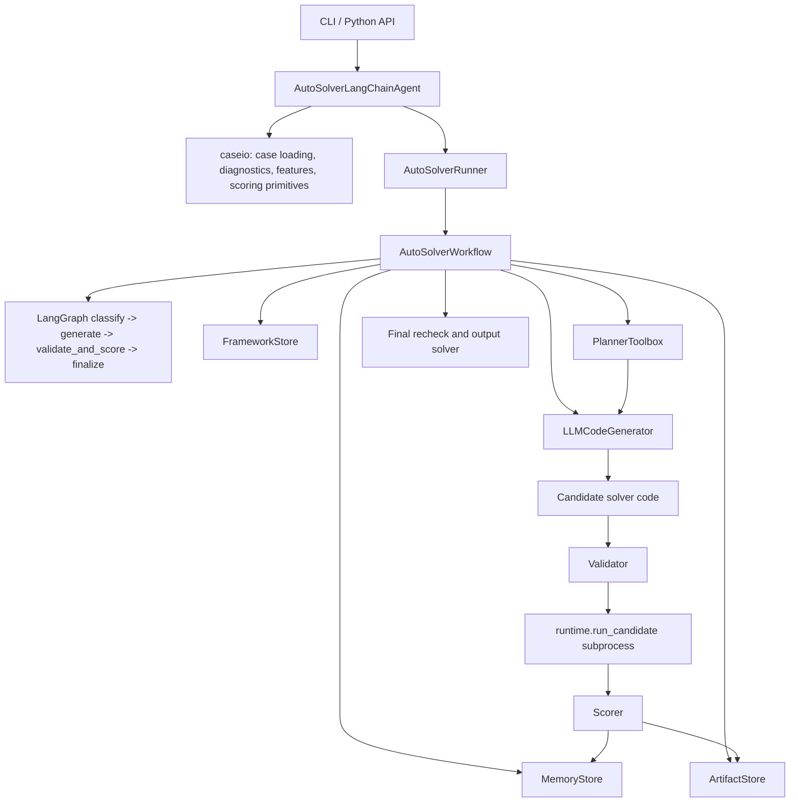

# AutoSolver Agent

## 项目概览

当前发布版本：`v1.5.5`

AutoSolver Agent 是一个面向配送分配问题的自动求解器生成系统。它基于 LangChain、LangGraph 和 OpenAI 兼容 LLM 接口，将实例分析、策略规划、候选代码生成、安全验证、评分、长期记忆和最终复核组织成一条可追踪的迭代工作流。

项目目标不是固定运行某一个手写启发式 solver，而是根据输入 case 的结构和历史实验结果，让 LLM 维护一套可演进的求解框架，并持续生成满足 `solve(input_text: str) -> list` 契约的 Python 求解器。

### 报告摘要

| 项目 | 内容 |
| --- | --- |
| 研究对象 | 配送分配候选集上的自动 solver 生成与评估。 |
| 核心方法 | 使用 LLM 进行实例解释、策略规划、候选代码生成和框架记忆更新。 |
| 工作流 | `classify -> generate -> validate_and_score -> finalize`。 |
| 评价目标 | 优先减少失败 case，其次提高任务覆盖、降低 penalty、缩短运行时间。 |
| 约束边界 | 生成 solver 必须满足固定函数契约，并通过静态检查、子进程运行和评分复核。 |
| 主要产出 | 最终 solver、完整 JSON report、summary、事件日志、候选代码和记忆文件。 |

总体来看，本仓库实现的是一套可审计的自动求解实验框架：LLM 负责提出和迭代策略，程序化验证器和评分器负责约束策略边界，并将实验结果沉淀到长期记忆中。

## 问题与评价体系

### 问题定义与评价目标

输入是 TSV 格式的配送分配候选集。每一行表示一个任务组 `task_id_list` 可以分配给某个 `courier_id`，并带有该组合的 `total_score` 和 `willingness`。

Agent 生成的 solver 需要返回一组不冲突的任务组和骑手列表。评分目标优先级为：

1. 更少失败 case。
2. 覆盖更多任务。
3. 更低总 penalty。
4. 更短运行时间。

内部排序 rank 为：

```text
(failures, -total_covered, total_penalty, total_runtime)
```

### 数据格式

case 文件必须是 UTF-8 TSV 文本，首行包含：

```text
task_id_list	courier_id	total_score	willingness
```

字段说明：

| 字段 | 说明 |
| --- | --- |
| `task_id_list` | 任务 ID 或合单任务 ID，多个任务用英文逗号连接，例如 `t0,t1`。 |
| `courier_id` | 可承接该任务组的骑手 ID。 |
| `total_score` | 该任务组分配给该骑手后的预计算成本或分数。 |
| `willingness` | 骑手接起该任务组的概率。 |

示例：

```text
task_id_list	courier_id	total_score	willingness
t0	c0	10	0.8
t0	c1	30	0.3
t1	c1	12	0.7
t0,t1	c2	40	0.6
```

解析器会拒绝缺少表头、字段不足、空任务组、空骑手或非数值分数的 case，并通过 `CaseParseError` 携带诊断信息。

### 输出契约与安全边界

最终生成文件必须定义顶层函数：

```python
def solve(input_text: str) -> list:
    ...
```

返回值必须是：

```python
list[tuple[str, list[str]]]
```

每个元素表示：

```python
("task_id_list", ["courier_id", "..."])
```

约束：

- `task_id_list` 必须是输入中存在的任务组字符串，例如 `t0` 或 `t0,t1`。
- `courier_ids` 必须是非空 `list[str]`，不能是单个字符串。
- 同一个任务不能在多个返回项中重复出现。
- 同一个骑手不能在同一返回项或不同返回项中重复使用。
- 每个骑手都必须对该任务组有效。
- 允许不覆盖全部任务，未覆盖任务会按每任务 `100.0` fallback 进入 penalty。

候选代码安全限制：

- 必须是自包含 Python 代码。
- 不允许文件 IO、网络 IO、subprocess、动态 import、`eval`、`exec`、`compile`。
- 允许的 import 根包括 `bisect`、`collections`、`copy`、`csv`、`dataclasses`、`functools`、`heapq`、`io`、`itertools`、`json`、`math`、`operator`、`random`、`re`、`statistics`、`time`、`typing`，以及运行环境可用的 `numpy`、`scipy`、`networkx`。

### 评价模型

单个任务组的 penalty 由候选骑手集合共同决定：

```text
fallback = 100.0 * task_count
reject_prob = product(1.0 - willingness_i)
weighted_score = sum(willingness_i * score_i) / sum(willingness_i)
penalty = reject_prob * fallback + (1.0 - reject_prob) * weighted_score
```

如果没有有效 willingness 权重，则使用 fallback。

整份答案的 penalty 为所有返回任务组 penalty 之和，再加上未覆盖任务 fallback。无效答案、运行错误或超时会被赋予高额失败 penalty，并在 rank 中优先落后。

## 技术方案与方法

### 系统能力概览

- LLM 维护的求解框架：运行时自动创建并更新 feature dimension、strategy 和 skill 记忆，不再依赖硬编码策略目录。
- LangGraph 工作流：核心链路为 `classify -> generate -> validate_and_score -> finalize`。
- LangChain 工具化规划：规划阶段可读取实例特征、求解框架、相似历史实验、UCB bandit 推荐和当前最佳 artifact 摘要。
- 多策略并行：`--strategy-workers` 为 1 时在当前进程运行，2 个以上时可启动独立 worker 进程并全局复评最优候选。
- 实时进度输出：verbose 模式下终端会显示每个 worker、每一轮和每个阶段的进入、完成、耗时、剩余预算和当前摘要。
- 基线 solver 导入：可通过 `--baseline-solver` 或 `--base-solver` 将已有 `.py` solver 纳入同一验证、评分和最终候选池。
- 验证与修复闭环：结构化输出失败或候选验证失败后，可由 LLM 在受控次数内修复。
- LLM JSON 兼容解析：结构化输出和框架解析可从 fenced code block、混杂说明文本和 `<think>...</think>` 包裹内容中恢复 JSON 文档。
- OpenAI 兼容请求扩展：可通过 `AUTOSOLVER_LLM_EXTRA_BODY` / `OPENAI_EXTRA_BODY` 传入 provider-specific JSON 参数。
- 子进程沙箱：候选代码在独立进程中执行，受 import 白名单、危险调用检查、CPU 时间和内存限制保护。
- 可审计产物：每个候选的代码、rationale、validation、score、impact、事件日志、最终报告都会落盘。

### 技术方案与系统架构



总体运行流程：

1. `AutoSolverLangChainAgent` 加载 case、解析数据、计算 deadline，并创建 `AutoSolverRunConfig`。
2. `AutoSolverRunner` 根据 `strategy_workers` 决定当前进程单工作流或多进程 worker 模式。
3. `AutoSolverWorkflow` 在 `classify` 阶段提取 objective features，并由 LLM 维护求解框架和实例解释。
4. `generate` 阶段通过 LangChain tools 规划 `SolverPlan`，再生成一个或多个 `CandidateEnvelope`。
5. `validate_and_score` 阶段先做 AST 静态检查，再运行 smoke case，最后对有效候选评分。
6. 验证失败或结构化输出失败时，`RepairService` 调用 LLM 修复候选。
7. 每轮评估后，LLM 根据实验结果向 `FrameworkStore` 提交 partial update。
8. `finalize` 阶段按正式超时复核 top-k 候选，输出最终 solver、summary 和完整 report。

### 方法说明：Agent 流程详解

Agent 的一次运行可以理解为“读取实例 -> 建立问题画像 -> 选择策略 -> 生成候选 -> 验证评分 -> 反馈记忆 -> 复核输出”的闭环。每个阶段都会把关键上下文写入 report、artifact 或 event log，方便复盘 LLM 为什么选择某个策略、某个候选为什么失败，以及最终 solver 为什么胜出。

#### 1. 实例画像与框架初始化

`classify` 阶段先用 `caseio` 解析所有 case，提取任务规模、候选边数量、任务组大小、骑手复用、分数分布、willingness 分布等 objective features。随后 agent 会读取长期实验记忆，并把相似实验、bandit 推荐和当前 `FrameworkStore` 快照合并成 `memory_digest`。

如果 `framework_memory.json` 为空，LLM 会先 bootstrap 一份求解框架。这个框架不是可执行代码，而是三类可维护知识：

- `feature_dimensions`：如何解释实例特征，例如稀疏匹配、合单密度、骑手竞争强度、风险分布。
- `strategies`：候选求解策略，例如贪心排序、局部替换、组合枚举、图匹配、随机扰动。
- `skills`：可复用实现提示，例如输入解析方式、冲突检测、增量 penalty 计算、超时保护。

后续运行会复用并更新这份框架，而不是每次从零开始规划。

#### 2. 策略规划

`generate` 阶段不会直接要求 LLM 输出代码，而是先要求 LLM 产生结构化 `SolverPlan`。规划阶段可通过 LangChain tools 读取：

- 当前实例画像和 LLM 对实例的解释。
- LLM 维护的 feature、strategy、skill 框架。
- 与当前特征最相近的历史实验。
- UCB bandit 的探索/利用推荐。
- 当前最佳候选的摘要和评分表现。

`SolverPlan` 必须给出 `strategy_combination`、参数调整、探索模式、推理依据、风险控制和代码生成指令。这样候选代码的来源可以被审计，也便于失败后针对原计划修复。

#### 3. 候选生成与并行探索

单 worker 模式下，每轮通常围绕一个 `SolverPlan` 生成一个候选。`--strategy-workers` 大于 1 时，agent 会从以下来源组合多个 primary strategy：

- 当前 plan 的 `strategy_combination`。
- 实例解释中的 `recommended_focus` 和 tags。
- 长期记忆中的 bandit 推荐 arm。
- `FrameworkStore` 中仍处于 active 状态的策略名称。

这些 primary strategy 会被派生成多个 parallel plan，并附加不同的 generation directives。候选生成、静态验证和搜索阶段评分会尽量并行执行；多进程 worker 模式下，各 worker 独立搜索，主进程最后收集 top-k 候选并统一复评。

#### 4. 验证、修复与评分

每个候选必须先通过 `Validator`：

- 解析 AST，拒绝文件 IO、网络 IO、subprocess、动态 import、`eval`、`exec` 等危险能力。
- 检查代码包含顶层 `solve(input_text: str) -> list` 契约。
- 在子进程中运行 smoke case，避免候选污染主进程。
- 验证返回结构、任务冲突、骑手冲突和候选有效性。

如果 LLM 返回的 JSON 不符合 `CandidateEnvelope`，或候选未通过验证，`RepairService` 会把错误、原计划、实例摘要、当前最佳摘要和历史记忆交回 LLM，在 `--max-repair-attempts` 限制内尝试修复。只有有效候选才会进入 `Scorer`，评分时使用搜索阶段 timeout，并计算 failures、覆盖任务数、penalty、runtime 和与当前最佳的 convergence。

#### 5. 反馈、记忆与最终复核

每次候选评估后，agent 会记录短期运行记忆和长期实验记忆：

- 短期记忆保存当前 run 的候选、验证、评分、错误和 impact。
- 长期记忆保存跨 run 的策略历史、特征-策略效果、实验记录和 bandit arm 统计。
- 框架记忆保存 LLM 对 feature、strategy、skill 的新增、修订或 retired 状态。

`finalize` 不直接信任搜索阶段的最好成绩，而是按 `--finalize-top-k` 取排名靠前候选，用正式 `--per-case-timeout` 重新评分。最终输出的是复核后 rank 最优的候选代码，同时写出完整 report、summary 和事件日志。

### 策略设计与迭代机制

本仓库的策略不是固定的 if/else 目录，而是一套由 LLM 维护、由验证器和评分器约束的可演进知识。它遵循以下原则：

- 先保有效性，再追求分数：任何策略都不能绕过输出契约、安全限制、冲突约束和 runtime sandbox。
- 结合实例特征选策略：小规模 dense case 可以尝试组合枚举或局部搜索；大规模 sparse case 更适合排序贪心、候选剪枝和增量评估。
- 探索与利用并存：bandit 会优先推荐历史收益高的 strategy arm，同时给未充分尝试的 arm 冷启动探索机会。
- baseline 只是候选之一：通过 `--baseline-solver` 导入的 solver 会走同样的验证、评分、impact 和最终复核流程，不会被特殊信任。
- 策略必须可解释：每个候选 rationale 都记录 idea、strategy combination、参数变化、expected effect 和 risk control。
- 失败也是信号：验证失败、超时、低覆盖或 penalty 恶化都会进入 memory，影响后续相似实例的策略选择。
- 框架更新受约束：LLM 可以维护策略知识，但不能放宽 parser、validator、scorer、runtime 或 solver contract。

实际求解时，常见策略组合包括：

| 策略方向 | 适用信号 | 实现要点 |
| --- | --- | --- |
| 覆盖优先贪心 | 任务多、候选边稀疏、失败风险主要来自未覆盖任务 | 按单位 penalty 改善、任务数、willingness 或 score 排序，逐步选择无冲突任务组。 |
| 低 penalty 贪心 | 分数差异大、willingness 差异大 | 用期望 penalty 或 fallback 改善量排序，优先选择风险收益比高的任务组。 |
| 合单优先 | 多任务组候选丰富、合单 willingness 可接受 | 比较合单与拆单的边际收益，避免早期选择单任务导致后续合单不可用。 |
| 骑手稀缺保护 | 骑手复用严重、冲突密集 | 对热门骑手设置机会成本，保留给更高收益任务组。 |
| 局部改良 | 已有可行解但 penalty 偏高 | 在当前解周围尝试替换、交换、释放骑手或重选任务组。 |
| 随机扰动/多启动 | 排序规则接近、局部最优明显 | 用不同权重或随机种子产生多个可行解，再保留评分最优者。 |
| 小规模精确搜索 | 任务和候选数量较小 | 对候选做剪枝后枚举、动态规划或图匹配，注意超时边界。 |

策略是否保留不由 LLM 自说自话决定，而由 `ScoreResult.rank`、impact analysis 和长期记忆中的 reward 共同反馈。下一次相似 case 到来时，planner 会同时看到成功策略、失败原因和当前实例特征，从而调整探索方向。

## 部署与运行

### 本地复现

准备 Python 3.10 及以上环境：

```bash
python -m venv .venv
source .venv/bin/activate
python -m pip install --upgrade pip
python -m pip install -e ".[dev]"
```

配置 OpenAI 兼容 LLM：

```bash
export OPENAI_API_KEY="your-api-key"
export OPENAI_BASE_URL="https://api.openai.com/v1"
export AUTOSOLVER_LLM_MODEL="gpt-4o-mini"
```

运行示例 case：

```bash
autosolver-agent \
  --cases examples/demo_case.txt \
  --out runs/manual/generated_submit_solution.py \
  --budget 90 \
  --iterations 3 \
  --strategy-workers 1 \
  --summary-out runs/manual/summary.json
```

也可以使用仓库中的脚本：

```bash
./run.sh examples/demo_case.txt
```

推荐通过环境变量提供 API key、模型、输出目录和超时配置，不要把真实密钥写入源码或提交到仓库。

### 容器化复现

构建镜像：

```bash
docker build \
  --build-arg VERSION=1.5.5 \
  --build-arg VCS_REF="$(git rev-parse --short HEAD)" \
  -t autosolver-agent:1.5.5 .
```

查看版本：

```bash
docker run --rm autosolver-agent:1.5.5 --version
```

运行 case：

```bash
docker run --rm \
  -e OPENAI_API_KEY="$OPENAI_API_KEY" \
  -e OPENAI_BASE_URL="$OPENAI_BASE_URL" \
  -e AUTOSOLVER_LLM_MODEL="$AUTOSOLVER_LLM_MODEL" \
  -v "$PWD/examples:/app/examples:ro" \
  -v "$PWD/runs:/app/runs" \
  autosolver-agent:1.5.5 \
  --cases examples/demo_case.txt \
  --out runs/docker/generated_submit_solution.py \
  --budget 90 \
  --iterations 3
```

### 运行配置：CLI 参数

命令入口来自 `pyproject.toml`：

```bash
autosolver-agent --help
```

常用参数：

| 参数 | 默认值 | 说明 |
| --- | --- | --- |
| `--cases` | 必填 | 一个或多个 case TSV 文件。 |
| `--out` | `generated_submit_solution.py` | 最终 solver 输出路径。 |
| `--budget` | `90.0` | 整体运行预算，单位秒。 |
| `--per-case-timeout` | `10.0` | 最终复核和正式评分的单 case 超时。 |
| `--search-per-case-timeout` | 同 `--per-case-timeout` | 生成搜索阶段的单 case 超时。 |
| `--iterations` | `3` | LLM 改进迭代次数。 |
| `--strategy-workers` | `5` | 策略 worker 数。`1` 为单工作流，`2+` 为多进程并行。 |
| `--baseline-solver` / `--base-solver` | 无 | 导入已有 solver 文件，可重复传入。 |
| `--finalize-top-k` | `3` | 最终复核排名靠前的候选数量。 |
| `--max-repair-attempts` | `2` | schema 或验证失败后的修复尝试次数。 |
| `--memory-top-k` | `5` | 相似历史实验检索数量。 |
| `--bandit-exploration` | `1.4` | UCB bandit 探索系数。 |
| `--memory-dir` | `runs/autosolver_memory` | 长期、短期和框架记忆目录。 |
| `--artifact-dir` | `runs/autosolver_artifacts` | 候选代码和中间产物目录。 |
| `--event-log` | `artifact-dir/events.jsonl` | JSONL 事件日志路径。 |
| `--summary-out` | 无 | 仅写出简要 summary JSON。 |
| `--llm-model` | 环境变量或 `gpt-4o-mini` | LLM 模型名。 |
| `--llm-base-url` | 环境变量 | OpenAI 兼容 base URL。 |
| `--quiet` | false | 关闭运行日志输出。 |

查看版本：

```bash
autosolver-agent --version
```

### 集成方式：Python API

```python
from autosolver_agent import AutoSolverLangChainAgent

agent = AutoSolverLangChainAgent(
    case_paths=["examples/demo_case.txt"],
    output_path="runs/manual/generated_submit_solution.py",
    budget_seconds=90,
    iterations=3,
    strategy_workers=1,
)

report = agent.run()
print(report["summary"])
```

测试中也支持传入 fake LLM：

```python
agent = AutoSolverLangChainAgent(
    case_paths=["case.txt"],
    output_path="generated_submit_solution.py",
    llm=fake_llm,
    strategy_workers=1,
)
```

传入 `llm` 时会在当前进程运行，方便单元测试和本地调试。

### 实验产物与可追踪性

默认产物包括：

| 路径 | 内容 |
| --- | --- |
| `--out` | 最终 solver Python 文件。 |
| `--out.report.json` | 完整运行报告。 |
| `--summary-out` | 可选简要 summary。 |
| `artifact-dir/events.jsonl` | 当前运行的结构化事件日志。 |
| `artifact-dir/iteration_XXX/*.py` | 每轮候选 solver。 |
| `artifact-dir/iteration_XXX/*.rationale.json` | 候选生成理由和策略信息。 |
| `artifact-dir/iteration_XXX/*.validation.json` | 静态和运行时验证结果。 |
| `artifact-dir/iteration_XXX/*.score.json` | 候选评分结果。 |
| `artifact-dir/iteration_XXX/*.impact.json` | 候选对当前最优解的影响分析。 |
| `memory-dir/long_term_memory.json` | 长期实验记忆和 bandit 统计。 |
| `memory-dir/framework_memory.json` | LLM 维护的求解框架。 |
| `memory-dir/short_term_last_run.json` | 最近一次短期运行记忆。 |

多 worker 模式下，每个 worker 会写入独立 artifact 子目录，例如：

```text
runs/autosolver_artifacts/worker_00/
runs/autosolver_artifacts/worker_01/
```

## 工程实现与质量保障

### 实现分工：模块职责

| 模块 | 职责 |
| --- | --- |
| `autosolver_agent.cli` | 命令行入口，解析参数并打印 JSON report。 |
| `autosolver_agent.agent` | Python API 主入口，装配 case、runner 和配置。 |
| `autosolver_agent.caseio` | case 解析、诊断、特征提取、penalty 与答案评分。 |
| `autosolver_agent.framework` | LLM 维护的 feature、strategy、skill 框架记忆及安全校验。 |
| `autosolver_agent.llm.generator` | LLM 调用、规划、代码生成、修复、框架 bootstrap 和反思更新。 |
| `autosolver_agent.llm.schema` | `SolverPlan`、`CandidateEnvelope` 等结构化输出协议。 |
| `autosolver_agent.workflow.runner` | 单进程或多 worker 运行编排，负责全局最终复评。 |
| `autosolver_agent.workflow.graph` | LangGraph 节点实现和候选生成、验证、评分、收尾逻辑。 |
| `autosolver_agent.workflow.services` | 生成、评估、修复、最终化和报告构建服务包装。 |
| `autosolver_agent.tools.langchain_tools` | 暴露给 planning LLM 的只读工具。 |
| `autosolver_agent.tools.validator` | 静态 AST 安全检查和 smoke runtime 校验。 |
| `autosolver_agent.tools.scorer` | 多 case 候选评分与收敛比较。 |
| `autosolver_agent.runtime` | 子进程执行候选 solver，并限制资源和 import。 |
| `autosolver_agent.memory` | 长期实验记忆、短期运行记忆、相似检索和 UCB bandit。 |
| `autosolver_agent.artifacts` | 候选代码、rationale、validation、score、impact 和 JSON 原子写入。 |
| `autosolver_agent.events` | JSONL 事件日志、阶段计时和候选代码 hash。 |
| `solvers` | 参考 solver、seed solver 和历史最佳 solver。 |
| `examples` | 示例 case、示例提交和 solver 模板。 |
| `tests` | 使用 fake LLM 覆盖 parser、validator、memory、runner、repair 和 CLI。 |

### 仓库结构

```text
.
├── autosolver_agent/
│   ├── agent.py
│   ├── artifacts.py
│   ├── caseio.py
│   ├── cli.py
│   ├── events.py
│   ├── framework.py
│   ├── runtime.py
│   ├── llm/
│   ├── memory/
│   ├── skills/
│   ├── tools/
│   └── workflow/
├── examples/
├── solvers/
├── tests/
├── Dockerfile
├── pyproject.toml
├── requirements.txt
├── run.sh
├── README.md
└── RELEASE.md
```

运行产物默认写入 `runs/`，该目录不属于发布源码。

### 验证与质量保障

运行单元测试：

```bash
python -m unittest discover -s tests -v
```

运行静态检查：

```bash
ruff check .
mypy autosolver_agent
```

打包入口检查：

```bash
python -m pip install -e .
autosolver-agent --version
```

构建 Python 发布包：

```bash
python -m build
```

CI 当前执行：

- 安装 `.[dev]`。
- `ruff check .`。
- `mypy autosolver_agent`。
- `python -m unittest discover -s tests -v`。
- Docker build smoke test。

### 运行环境：环境变量

| 环境变量 | 说明 |
| --- | --- |
| `OPENAI_API_KEY` / `OPENAI_KEY` | LLM API key。 |
| `OPENAI_BASE_URL` / `OPENAI_API_BASE` | OpenAI 兼容服务地址。 |
| `AUTOSOLVER_LLM_MODEL` / `OPENAI_MODEL` | 默认模型名，优先使用 `AUTOSOLVER_LLM_MODEL`。 |
| `AUTOSOLVER_LLM_TIMEOUT` / `OPENAI_TIMEOUT` / `OPENAI_REQUEST_TIMEOUT` | 单次 LLM 请求超时秒数，默认 `300`。 |
| `AUTOSOLVER_WIRE_API` / `OPENAI_WIRE_API` | 设为 `responses` 时启用 responses API。 |
| `AUTOSOLVER_REASONING_EFFORT` / `OPENAI_REASONING_EFFORT` | 传递 reasoning effort。 |
| `AUTOSOLVER_LLM_EXTRA_BODY` / `OPENAI_EXTRA_BODY` | JSON 对象字符串，透传给 ChatOpenAI 的 `extra_body`，用于 OpenAI 兼容服务的额外参数。 |
| `AUTOSOLVER_DISABLE_RESPONSE_STORAGE` / `OPENAI_DISABLE_RESPONSE_STORAGE` | 为真时向 ChatOpenAI 传入 `store=False`。 |
| `AUTOSOLVER_MEMORY_MAX_ITEMS` | 长期记忆每类列表保留上限。 |

`run.sh` 还会读取：

| 环境变量 | 默认值 |
| --- | --- |
| `PYTHON_BIN` | 自动检测。 |
| `AUTOSOLVER_LLM_MODEL` / `OPENAI_MODEL` | `gpt-5.5` |
| `AUTOSOLVER_OUT` | `runs/manual/generated_submit_solution.py` |
| `AUTOSOLVER_BUDGET` | `3600` |
| `AUTOSOLVER_ITERATIONS` | `100` |
| `AUTOSOLVER_STRATEGY_WORKERS` | `5` |
| `AUTOSOLVER_PER_CASE_TIMEOUT` | `10` |
| `AUTOSOLVER_SEARCH_PER_CASE_TIMEOUT` | `10` |
| `AUTOSOLVER_MEMORY_DIR` | `runs/autosolver_memory` |
| `AUTOSOLVER_ARTIFACT_DIR` | `runs/autosolver_artifacts` |
| `AUTOSOLVER_SUMMARY_OUT` | `runs/manual/summary.json` |
| `AUTOSOLVER_BASELINE_SOLVER` | `examples/solver_template_1.py`，多个 solver 用 `:` 分隔。 |

## 总结与版本信息

### 报告结论

AutoSolver Agent 将 LLM 的策略探索能力与确定性的工程约束结合起来，用验证器、评分器、长期记忆和最终复核控制自动生成代码的风险。当前实现已经覆盖从 case 解析、策略生成、候选修复、并行探索到最终报告落盘的完整实验链路，适合用于配送分配类启发式 solver 的快速迭代与可追踪对比。

后续改进可以围绕三点展开：扩展更多可复用策略知识，增加不同规模 case 的公开 benchmark，进一步细化 report 中的策略收益分析。

### 版本说明

`v1.5.5` 增强 OpenAI 兼容端点和结构化输出容错：支持 provider-specific `extra_body`，可从混杂文本中恢复 JSON，并放宽候选 solver 的安全解析 import 白名单。详细发布记录见 `RELEASE.md`。
