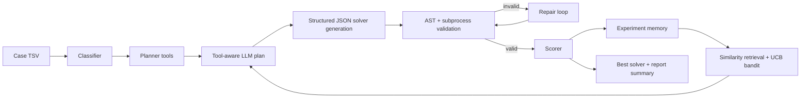

# AutoSolver Agent

AutoSolver Agent is a LangGraph/LangChain-based solver-generation agent for delivery assignment optimization. It classifies an input case, plans with tool-accessible context, asks an LLM to produce a complete `solve(input_text: str) -> list` solver, validates the solver, scores it, records experiment memory, and iterates toward the best candidate.

## Architecture



## What This Shows

- **Agent orchestration:** LangGraph workflow with classify, plan, generate, validate, repair, score, and finalize phases.
- **Tool use:** planning tools expose instance features, strategy guidance, similar experiments, bandit recommendations, and best artifact summaries to LangChain-compatible LLMs.
- **Structured generation:** candidates use a Pydantic-validated JSON envelope containing rationale and full Python code.
- **Self-repair:** malformed schema output and validation failures are repaired without consuming the main iteration count.
- **Learning memory:** long-term experiment records store features, strategies, parameters, scores, failure reasons, and UCB bandit statistics.
- **Auditability:** per-iteration code, rationale, validation, score, impact, planner trace, repair history, and report summary are persisted.

## Install

Use the project virtual environment:

```bash
.venv/bin/python -m pip install -r requirements.txt
```

Set an OpenAI-compatible key for real LLM runs:

```bash
export OPENAI_API_KEY=sk-...
export AUTOSOLVER_LLM_MODEL=gpt-4o-mini
```

Optional compatible endpoint:

```bash
export OPENAI_BASE_URL=https://api.example.com/v1
```

## Demo Run

```bash
.venv/bin/python langchain_autosolver_agent.py \
  --cases examples/demo_case.txt \
  --iterations 3 \
  --budget 60 \
  --per-case-timeout 5 \
  --search-per-case-timeout 2 \
  --memory-dir runs/autosolver_memory \
  --artifact-dir runs/autosolver_artifacts \
  --summary-out runs/autosolver_summary.json \
  --out runs/generated_submit_solution.py
```

The agent writes:

- final solver: `runs/generated_submit_solution.py`
- full report: `runs/generated_submit_solution.py.report.json`
- summary report: `runs/autosolver_summary.json`
- long-term memory: `runs/autosolver_memory/long_term_memory.json`
- last short-term memory: `runs/autosolver_memory/short_term_last_run.json`
- per-iteration artifacts under `runs/autosolver_artifacts/`

## Report Summary Example

```json
{
  "best_candidate": "solver_v3",
  "best_covered": 3,
  "best_penalty": 72.5,
  "candidates_generated": 5,
  "repairs_attempted": 1,
  "valid_scores": 3
}
```

## Test

```bash
.venv/bin/python -m unittest discover -s tests -v
```

The tests use fake LLM responses and do not require network access.

## Resume Angle

This project can be presented as an agent engineering system rather than a single heuristic script: it combines tool-aware planning, structured LLM generation, validation-driven repair, experiment memory, bandit-guided strategy selection, and auditable evaluation artifacts.
