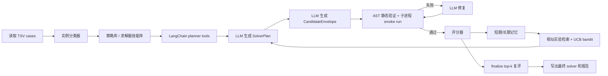

# AutoSolver Agent

AutoSolver Agent 是一个基于 LangGraph / LangChain 的配送分配求解器生成系统。它不会只固定运行某个手写启发式算法，而是把“实例分析、策略规划、代码生成、验证、评分、记忆沉淀和迭代改进”组织成一个可审计的 Agent 工作流。

项目当前面向外卖配送分配问题：输入若干个 TSV case，LLM 生成一个完整的 Python `solve(input_text: str) -> list` 求解器，系统自动验证该求解器是否满足约束，按目标函数评分，将候选代码与实验结果写入磁盘，并在多轮迭代中保留当前最优解。

## 当前实现

- **LangGraph 工作流编排**：已实现 `classify -> generate -> validate_and_score -> finalize` 节点；依赖缺失时可退化为顺序执行。
- **LangChain 工具化规划**：规划阶段向 LLM 暴露实例特征、策略库、相似历史实验、UCB bandit 推荐和当前最优 artifact 摘要。
- **结构化生成协议**：规划输出使用 `SolverPlan`，代码生成输出使用 `CandidateEnvelope`，由 Pydantic 做 schema 校验。
- **验证驱动修复**：支持 schema 失败修复和候选代码验证失败修复，修复次数由 `--max-repair-attempts` 控制。
- **标准库求解器约束**：生成的最终 solver 只允许依赖 Python 标准库，并必须提供 `solve(input_text: str) -> list`。
- **实验记忆**：保存短期运行记忆、长期实验记录、相似实验检索结果和策略组合的 UCB 统计。
- **可追溯产物**：每轮候选代码、生成理由、验证结果、评分结果、影响分析、最终报告都会落盘。

## 目录结构

```text
.
├── langchain_autosolver_agent.py        # CLI 入口
├── autosolver_agent/
│   ├── agent.py                         # 顶层 AutoSolverLangChainAgent
│   ├── caseio.py                        # case 解析、特征提取、评分基础函数
│   ├── runtime.py                       # 子进程执行候选 solver
│   ├── workflow/graph.py                # LangGraph / 顺序工作流
│   ├── llm/                             # LLM 规划、生成、修复和结构化 schema
│   ├── tools/                           # 分类器、验证器、评分器、LangChain planner tools
│   ├── memory/                          # 短期/长期记忆、相似检索、UCB bandit
│   └── skills/                          # 策略库与求解器实现提示库
├── examples/demo_case.txt               # 示例 case
├── tests/test_modular_agent.py          # 单元测试，使用 fake LLM
├── README_langchain_agent.md
├── describe.txt
└── requirements.txt
```

## 输入格式

case 文件是制表符分隔的 TSV 文本，首行必须包含：

```text
task_id_list	courier_id	total_score	willingness
```

字段含义：

- `task_id_list`：任务 ID 或合单任务 ID，多个任务用逗号连接，例如 `t0,t1`。
- `courier_id`：可承接该任务组的骑手 ID。
- `total_score`：该任务组分配给该骑手后的预计算成本/分数。
- `willingness`：骑手接起该任务组的概率。

示例：

```text
task_id_list	courier_id	total_score	willingness
t0	c0	10	0.8
t1	c1	12	0.7
t0,t1	c2	40	0.6
```

## Solver 输出契约

Agent 最终生成的文件必须定义：

```python
def solve(input_text: str) -> list:
    ...
```

返回值必须是 Python list，形如：

```python
[("t0,t1", ["c2"]), ("t2", ["c0", "c3"])]
```

合法性约束：

- 每个任务最多出现一次。
- 每个骑手在全局最多出现一次。
- 输出中的 `task_key` 必须存在于输入。
- 输出中的每个骑手必须对该 `task_key` 有合法输入行。
- 每个任务组至少分配一个骑手。
- 返回 Python 对象，不是 JSON 字符串。

验证器还会拒绝候选代码中的危险能力，例如文件 IO、网络 IO、`subprocess`、动态 import、`eval`、`exec`、`compile` 等。

## 评分规则

系统对候选 solver 的排序目标是：

1. 失败 case 数更少。
2. 覆盖任务数更多。
3. 总 penalty 更低。
4. 总运行时间更短。

单个任务组分配给多个骑手时，系统按接单概率估算 penalty：

```text
reject_prob = Π(1 - willingness_i)
weighted_score = Σ(willingness_i * score_i) / Σ(willingness_i)
group_penalty = reject_prob * 100 * task_count + (1 - reject_prob) * weighted_score
```

未覆盖任务会额外按每个任务 `100` 加罚。候选排序 rank 在代码中表示为：

```text
(failures, -total_covered, total_penalty, total_runtime)
```

## Agent 工作流



每轮迭代会记录：

- 规划 trace 和工具调用记录。
- 候选代码与 rationale。
- 验证结果与修复历史。
- 评分结果与是否改进当前最优。
- 对策略组合和参数变化的影响分析。
- 写入长期记忆的实验记录。

## 安装

建议在项目虚拟环境中安装依赖：

```bash
.venv/bin/python -m pip install -r requirements.txt
```

真实 LLM 运行需要 OpenAI 兼容接口密钥：

```bash
export OPENAI_API_KEY=sk-...
export AUTOSOLVER_LLM_MODEL=gpt-4o-mini
```

可选配置：

```bash
export OPENAI_BASE_URL=https://api.example.com/v1
export AUTOSOLVER_WIRE_API=responses
export AUTOSOLVER_REASONING_EFFORT=medium
export AUTOSOLVER_DISABLE_RESPONSE_STORAGE=true
```

也支持使用 `OPENAI_KEY`、`OPENAI_API_BASE`、`OPENAI_WIRE_API`、`OPENAI_REASONING_EFFORT`、`OPENAI_DISABLE_RESPONSE_STORAGE` 作为兼容环境变量。

## 快速运行

```bash
.venv/bin/python langchain_autosolver_agent.py \
  --cases examples/demo_case.txt \
  --iterations 3 \
  --budget 60 \
  --per-case-timeout 5 \
  --search-per-case-timeout 2 \
  --memory-dir runs/autosolver_memory \
  --artifact-dir runs/autosolver_artifacts \
  --summary-out runs/autosolver_summary.json \
  --out runs/generated_submit_solution.py
```

运行完成后会写出：

- `runs/generated_submit_solution.py`：最终 solver。
- `runs/generated_submit_solution.py.report.json`：完整运行报告。
- `runs/autosolver_summary.json`：可选摘要报告。
- `runs/autosolver_memory/long_term_memory.json`：长期实验记忆。
- `runs/autosolver_memory/short_term_last_run.json`：最近一次短期记忆。
- `runs/autosolver_artifacts/events.jsonl`：结构化运行事件日志。
- `runs/autosolver_artifacts/iteration_*/`：每轮候选代码、rationale、validation、score 和 impact。

## CLI 参数

| 参数 | 默认值 | 说明 |
| --- | --- | --- |
| `--cases` | 必填 | 一个或多个 case TSV 文件。 |
| `--out` | `generated_submit_solution.py` | 最终 solver 输出路径。 |
| `--budget` | `90.0` | 整体 Agent 运行预算，单位秒。 |
| `--per-case-timeout` | `10.0` | finalize 复评时的单 case 超时。 |
| `--search-per-case-timeout` | 同 `--per-case-timeout` | 迭代搜索阶段的单 case 超时。 |
| `--iterations` | `3` | LLM 改进迭代轮数。 |
| `--memory-dir` | `runs/autosolver_memory` | 短期/长期记忆目录。 |
| `--artifact-dir` | `runs/autosolver_artifacts` | 每轮 artifact 目录。 |
| `--llm-model` | 环境变量或 `gpt-4o-mini` | LLM 模型名。 |
| `--llm-base-url` | 环境变量 | OpenAI 兼容 API 地址。 |
| `--max-cases` | `3` | 本次最多加载的 case 数。 |
| `--finalize-top-k` | `3` | finalize 阶段复评排名前 K 的候选。 |
| `--max-repair-attempts` | `2` | schema 或验证失败后的最大修复次数。 |
| `--memory-top-k` | `5` | 规划时检索的相似历史实验数量。 |
| `--bandit-exploration` | `1.4` | UCB 探索系数。 |
| `--summary-out` | `None` | 可选 JSON 摘要输出路径。 |
| `--strict-cases` | `False` | 遇到坏 case 行时直接失败；默认只写入诊断。 |
| `--event-log` | `artifact-dir/events.jsonl` | 可选 JSONL 结构化事件日志路径。 |
| `--quiet` | `False` | 关闭运行日志。 |

## Python API

```python
from autosolver_agent import AutoSolverLangChainAgent

agent = AutoSolverLangChainAgent(
    case_paths=["examples/demo_case.txt"],
    output_path="runs/generated_submit_solution.py",
    budget_seconds=60,
    per_case_timeout=5,
    search_per_case_timeout=2,
    iterations=3,
    strict_cases=False,
    event_log_path="runs/autosolver_artifacts/events.jsonl",
)

report = agent.run()
```

测试中也可以向 `AutoSolverLangChainAgent(llm=...)` 注入 fake LLM，用于离线验证工作流。

## 测试

```bash
.venv/bin/python -m unittest discover -s tests -v
.venv/bin/python -m ruff check .
.venv/bin/python -m mypy autosolver_agent
.venv/bin/python -m coverage run -m unittest discover -s tests -v
.venv/bin/python -m coverage report
```

单元测试使用 fake LLM 响应，不需要网络访问。覆盖范围包括：

- case 解析、实例分类和评分。
- 静态验证、非法输出验证。
- 结构化生成 schema。
- 短期/长期记忆、相似实验检索和 UCB 推荐。
- Agent 端到端运行、schema 修复、验证修复和 CLI 参数解析。

## 当前边界

- 真实运行需要可用的 OpenAI 兼容 LLM 接口；未提供 API key 时不会自动退化成内置启发式求解器。
- 生成 solver 的运行环境被刻意限制，主要用于比赛/评测式纯函数求解，不适合依赖外部文件、网络或第三方库。
- 当前策略库是提示级知识库，实际最终算法由 LLM 生成，并通过验证、评分和记忆机制筛选。
- `runs/` 下的 artifact 和 memory 是实验状态，适合保留用于后续迭代，但不应当视作源码的一部分。
