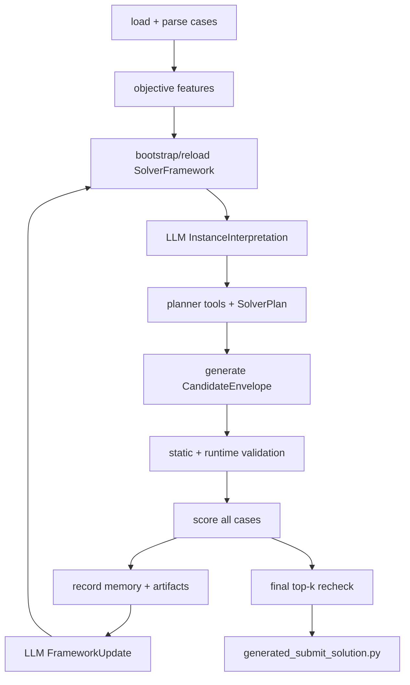

# AutoSolver Agent 当前框架梳理

本文按当前代码实现梳理 `autosolver_agent` 的架构。现在的系统已经去掉原有硬编码实例分类器、固定策略库和固定技能库，改为由 LLM 自行创建、解释、更新一套持久化的 solver framework。

## 1. 核心定位

`autosolver_agent` 是一个“生成式求解器 agent”，目标是在给定配送分配 TSV case 后，自动生成满足以下契约的 Python solver：

```python
def solve(input_text: str) -> list:
    ...
```

系统把能力拆成两层：

- **可信裁判层**：case 解析、静态校验、runtime 沙箱、合法性验证、评分函数、最终复评。这些由代码固定实现，LLM 不能修改。
- **可进化知识层**：实例解释维度、策略知识、实现技能、候选 solver 代码。这些由 LLM 通过结构化 JSON 生成和维护。

这个边界很重要：LLM 可以提出新的策略和实现技巧，但不能放宽 `solve()` 输出契约、validator、scorer、runtime 或 parser。

## 2. 主要目录职责

```text
autosolver_agent/
├── agent.py               # 顶层 Python API，加载 case 并启动 workflow/parallel runner
├── cli.py                 # CLI 参数解析入口
├── caseio.py              # TSV 解析、客观特征统计、答案合法性与 penalty 计算
├── framework.py           # LLM 维护框架的 schema、校验、持久化与 prompt context
├── llm/
│   ├── generator.py       # framework bootstrap、实例解释、规划、生成、修复、反思
│   └── schema.py          # SolverPlan 与 CandidateEnvelope 结构
├── workflow/
│   ├── graph.py           # 单 worker LangGraph 主流程
│   ├── services.py        # generation/evaluation/repair/finalization 服务代理
│   └── parallel.py        # 多进程 worker 编排与全局 top-k 复评
├── tools/
│   ├── langchain_tools.py # 给 planner LLM 的只读工具
│   ├── validator.py       # AST 静态检查与 smoke runtime 验证
│   └── scorer.py          # 全 case 评分
├── memory/store.py        # 短期/长期实验记忆与 UCB bandit
├── artifacts.py           # 候选代码、rationale、validation、score、impact 落盘
├── runtime.py             # 子进程沙箱执行候选 solver
└── skills/                # 已不再提供内置策略/技能目录
```

外围目录中，`tests/` 用 fake LLM 覆盖主要流程，`examples/` 放示例 case，`solvers/` 放参考 solver。

## 3. 运行入口

系统有两个入口：

- CLI：`autosolver-agent --cases examples/demo_case.txt ...`
- Python API：`AutoSolverLangChainAgent(...).run()`

`agent.py` 负责读取 case、调用 `caseio.parse_case()` 得到 `ParsedCase`，并根据 worker 数和是否注入 fake/custom LLM 选择运行路径：

- `strategy_workers == 1`：直接运行单个 `AutoSolverWorkflow`，不启动多进程。
- `strategy_workers >= 2` 且未注入 LLM：进入 `ParallelAutoSolverRunner` 多进程路径。
- 测试或注入 LLM：直接运行单个 `AutoSolverWorkflow`，但 workflow 内部仍可按 `strategy_workers` 做多候选批量探索。

多进程路径中，每个 worker 有独立 artifact 目录和 LLM 客户端，但共享 `memory_dir`，因此长期记忆和 `framework_memory.json` 是跨 worker 共享的。

## 4. 主执行闭环

当前单个 workflow 的节点是：

```text
classify -> generate -> validate_and_score -> finalize
```

其中 `classify` 是历史命名，现在实际做的是“客观特征提取 + LLM framework bootstrap + LLM 实例解释”。



核心闭环是：生成候选，验证评分，记录实验，再让 LLM 根据证据更新框架知识。下一轮规划会读取更新后的 framework、memory、bandit 和 best artifact。

## 5. LLM 维护的 SolverFramework

`framework.py` 是现在架构的关键模块。它定义了 6 个结构化对象：

- `FeatureDimension`：LLM 维护的特征解释维度，例如哪些统计信号有意义、如何解释。
- `StrategyKnowledge`：LLM 维护的策略知识，包括适用 tag、特征信号、实现说明、参数建议和风险。
- `SkillKnowledge`：LLM 维护的可复用实现技巧，包括代码契约、约束和示例说明。
- `SolverFramework`：持久化的完整框架，包含 feature dimensions、strategies、skills。
- `FrameworkUpdate`：每轮评估后的增量更新，可新增、替换或 retire 条目。
- `InstanceInterpretation`：针对当前 case 的动态解释，包含 tags、opportunities、risks、recommended_focus。

框架持久化在：

```text
memory_dir/framework_memory.json
```

`FrameworkStore` 负责读取、文件锁、原子写入、schema 校验、历史记录、`digest()` 和 `prompt_context()`。如果文件为空，第一次运行会调用 `LLMCodeGenerator.bootstrap_framework()` 生成初始框架。

## 6. 实例解释层

实例层现在由两部分组成。

第一部分是代码侧的客观统计，由 `caseio.dataset_features()` 和 `aggregate_features()` 生成，例如：

- `task_count`、`courier_count`、`row_count`
- `pair_ratio`、`bundle_ratio`、`bundle_task_coverage`
- `avg_candidates_per_group`、`avg_groups_per_courier`
- `avg_willingness`、`low_willingness_ratio`
- `score_spread`、`score_cv`
- `capacity_ratio`、`low_capacity`

第二部分是 LLM 解释，由 `LLMCodeGenerator.interpret_instances()` 输出 `InstanceInterpretation`。代码不再内置阈值标签、固定分类名或 `recommended_focus` 规则。LLM 根据客观统计、当前 framework、case samples 和 memory 自行生成 tags、风险、机会和建议关注策略。

最终写入 `workflow.instance_features` 的内容包括：

- `objective_features`
- `interpretation`
- 聚合后的 `tags` 与 `recommended_focus`
- 当前 `solver_framework` snapshot

## 7. 策略与技能层

原来的 `StrategyLibrary`、`SolverSkillLibrary`、`InstanceClassifier` 已被移除，源码不再保留兼容入口。策略和技能只能来自 `FrameworkStore` 中的 `SolverFramework`，或者由 LLM 在某一轮规划中创造新的策略名。

规划阶段的策略来源包括：

- base `SolverPlan.strategy_combination`
- `InstanceInterpretation.recommended_focus`
- `FrameworkStore.candidate_strategy_names()`
- `MemoryStore.bandit_recommendations()`
- 相似历史实验中的策略记录

如果 `strategy_workers > 1`，`_strategy_plan_batch()` 会把这些策略名扩展成多个并行 plan，让每个候选以不同 primary strategy 进行探索。真实多进程运行中，每个 worker 内部的 `strategy_workers` 会被设为 1，主要依赖进程级并行扩大搜索面。

## 8. LLM 调用职责

`LLMCodeGenerator` 现在有 5 类核心调用：

1. `bootstrap_framework()`：冷启动时创建初始 `SolverFramework`。
2. `interpret_instances()`：根据客观特征和 framework 解释当前实例。
3. `plan()`：通过 LangChain tools 读取上下文，输出结构化 `SolverPlan`。
4. `generate_from_plan()`：根据 plan 和上下文生成完整候选 solver。
5. `repair()`：在 schema、静态验证或 smoke runtime 失败后生成修复候选。
6. `reflect_framework()`：每轮评估后生成 `FrameworkUpdate`。

planner 可调用的工具都在 `PlannerToolbox` 中，且全部只读：

- `get_instance_features`
- `get_solver_framework`
- `retrieve_similar_experiments`
- `get_bandit_recommendations`
- `get_best_artifact_summary`

这保证了规划 LLM 能看到足够上下文，但不能直接修改 memory、artifact 或裁判逻辑。

## 9. 验证与评分边界

候选代码必须先通过 `Validator`：

- 必须定义顶层 `solve`。
- 禁止危险 import，例如 `os`、`sys`、`subprocess`、`socket`。
- 禁止 `open`、`eval`、`exec`、`compile`、`__import__`。
- 禁止候选 solver 导入 `time`，避免在生成代码中实现搜索阶段超时中断。
- 禁止 dunder attribute 访问。
- 必须在 smoke case 上返回合法答案。

runtime 层在独立子进程中执行候选代码，只暴露白名单 builtins 和白名单标准库 import，并设置 CPU、内存和输出限制。评分由 `Scorer.score()` 对全部 case 执行候选 solver，然后调用 `caseio.score_answer()` 计算覆盖、penalty、失败数和耗时。

候选排序使用：

```text
(failures, -total_covered, total_penalty, total_runtime)
```

也就是先保证失败 case 最少，再最大化覆盖任务数，再最小化 penalty，最后比较运行时间。

## 10. 记忆、反思与自进化

`MemoryStore` 维护两类记忆：

- 短期记忆：当前 run 的候选、验证错误、分数、impact、experiments。
- 长期记忆：跨 run 的 strategy history、feature-strategy effects、experiments、bandit arms。

每个候选都会通过 `record_experiment()` 记录策略、参数、特征、score、validation、artifact 路径和 reward。`bandit_recommendations()` 用 UCB 在冷启动探索和历史收益利用之间选择策略臂。

每轮 `validate_and_score` 结束后，workflow 调用 `_reflect_framework()`：

1. 汇总 plans、validation、score、impact、recent experiments。
2. 调用 LLM 输出 `FrameworkUpdate`。
3. `FrameworkStore.apply_update()` 校验 schema、名称唯一性、引用一致性和危险片段。
4. 更新成功则写回 `framework_memory.json`，失败则记录 `framework_update_rejected` 并沿用旧框架。

因此当前“自进化”的范围是策略知识、技能知识、实例解释维度和候选 solver，不包括自动修改 agent 源码。

## 11. 产物与报告

每轮候选都会落盘到 artifact 目录：

```text
runs/autosolver_artifacts/
├── worker_00/
│   ├── events.jsonl
│   └── iteration_001/
│       ├── candidate.py
│       ├── candidate.rationale.json
│       ├── candidate.validation.json
│       ├── candidate.score.json
│       └── candidate.impact.json
└── worker_01/
    └── ...
```

最终输出通常包括：

- `generated_submit_solution.py`
- `generated_submit_solution.py.report.json`
- `short_term_last_run.json`
- `long_term_memory.json`
- `framework_memory.json`
- `events.jsonl`

报告中会包含 `instance_features`、`solver_framework`、`framework_updates`、planner trace、tool calls、repair history、memory retrieval、bandit trace、experiments、validation errors 和 impact analysis。

## 12. 当前设计取舍

当前架构的优点：

- LLM 创造力集中在 framework、plan 和候选 solver 上，裁判逻辑保持稳定。
- 策略与技能不再被硬编码目录限制，可以随实验证据增长。
- 每个候选都有 artifact 和事件日志，便于复盘。
- 支持单 workflow 低成本运行，也支持多进程 worker 共享 memory/framework 扩大探索。
- fake LLM 测试路径可以覆盖主要流程，不依赖真实网络。

当前限制：

- planner 依赖支持 `bind_tools` 的 LangChain LLM。
- 搜索 case、验证 case、最终 holdout case 还没有显式分离。
- framework 更新质量依赖 LLM 输出，代码侧只做结构和安全校验，不判断策略是否真的聪明。
- 自进化不修改 agent 源码，主要进化外部知识和候选 solver。

## 13. 后续扩展方向

建议优先扩展以下能力：

1. `PopulationManager`：维护 elite、diversity、lineage、去重和局部变异。
2. holdout 评测：区分搜索集、调参验证集和最终复评集，降低过拟合。
3. mutation/crossover：基于当前 best solver 做 patch，而不是每次全量重写。
4. failure taxonomy：把 schema、validation、runtime、score 失败聚类成可检索经验。
5. framework evidence：给每个策略/技能记录支持实验、失败实验、胜率和适用边界。
6. memory migration：为 `long_term_memory.json` 与 `framework_memory.json` 增加迁移机制。

总体上，当前版本已经形成“客观特征 -> LLM 解释 -> LLM 规划 -> 候选生成 -> 验证评分 -> 记忆记录 -> framework 反思”的闭环。后续重点应放在评测隔离、种群管理和 framework 证据质量上，而不是扩大 LLM 对裁判层的权限。
